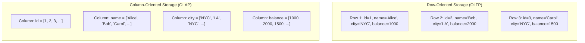
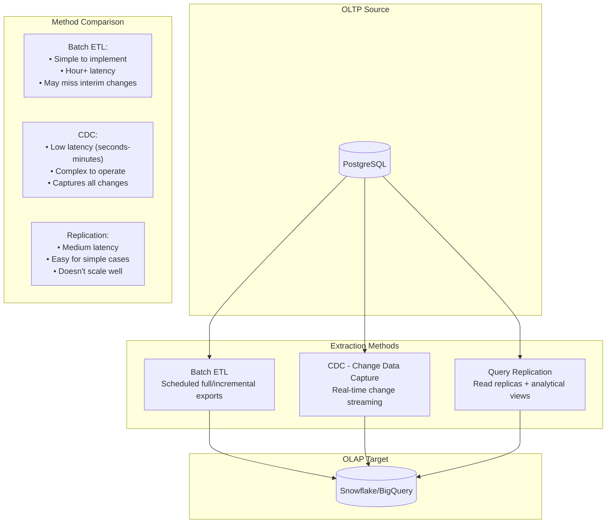

import { Aside, Card, CardGrid, Tabs, TabItem, Steps } from '@astrojs/starlight/components';

## 2.1 Fundamental Design Philosophy

These two paradigms exist because no single system can optimize for both transactional workloads and analytical workloads. The fundamental tension:

<CardGrid>
  <Card title="OLTP (Online Transaction Processing)" icon="rocket">
    Optimized for many small, concurrent operations that read and write individual records. The cash register model—fast, reliable, consistent operations on small amounts of data.
  </Card>
  <Card title="OLAP (Online Analytical Processing)" icon="magnifier">
    Optimized for few large operations that read many records to produce aggregates. The quarterly report model—scanning millions of rows to answer complex business questions.
  </Card>
</CardGrid>

| Dimension | OLTP | OLAP |
|-----------|------|------|
| **Primary Operation** | INSERT, UPDATE, DELETE | SELECT with aggregations |
| **Query Pattern** | Point lookups (WHERE id = X) | Full scans, range queries |
| **Data Volume per Query** | Rows to thousands | Millions to billions |
| **Concurrent Users** | Thousands | Dozens to hundreds |
| **Optimization Goal** | Transaction throughput | Query throughput |
| **Data Freshness** | Real-time | Minutes to hours acceptable |
| **Normalization** | Highly normalized (3NF+) | Denormalized (star/snowflake schema) |

## 2.2 Row-Oriented vs Column-Oriented Storage

The physical storage layout is the key differentiator:

<Tabs>
  <TabItem label="Row-Oriented (PostgreSQL, MySQL)" icon="seti:db">
    - Stores all columns of a row together on disk
    - Excellent for `SELECT * FROM users WHERE id = 12345`
    - Terrible for `SELECT AVG(balance) FROM users`
    - Reads entire rows even if you only need one column
  </TabItem>
  <TabItem label="Column-Oriented (Snowflake, BigQuery, ClickHouse)" icon="list-format">
    - Stores all values of a column together
    - Excellent for `SELECT city, SUM(balance) FROM users GROUP BY city`
    - Can read only the columns needed (massive I/O savings)
    - Better compression (similar values stored together)
    - Terrible for `INSERT INTO users VALUES (...)` (must update many files)
  </TabItem>
</Tabs>

## 2.3 Write-Optimized vs Read-Optimized

<Tabs>
  <TabItem label="OLTP systems optimize for writes" icon="pencil">
    - Append-only logging (WAL)
    - Small, fast index updates
    - ACID guarantees with minimal latency
    - Row-level locking
  </TabItem>
  <TabItem label="OLAP systems optimize for reads" icon="open-book">
    - Batch-oriented data loading
    - Pre-computed aggregations (materialized views, cubes)
    - Columnar compression (10-100x storage savings)
    - Partition pruning (skip entire data segments)
  </TabItem>
</Tabs>

## 2.4 Hybrid Approaches (HTAP)

**HTAP (Hybrid Transactional/Analytical Processing)** systems attempt to handle both workloads. Examples: TiDB, CockroachDB, SingleStore.

<Aside type="caution" title="The Reality">
**The promise**: One database for everything. No ETL. No synchronization.

**The reality**: Compromise. You get okay performance at both workloads, but excellent performance at neither. The trade-offs:
- More complex operational model
- Higher cost than specialized systems
- Still need to segregate workloads at scale
- Analytical queries can impact transactional performance
</Aside>

<CardGrid>
  <Card title="When HTAP Makes Sense" icon="approve-check">
    Early-stage companies with limited data volume, strong real-time requirements, and constrained operational capacity.
  </Card>
  <Card title="When to Avoid" icon="error">
    High-volume transactional systems, complex analytical workloads, cost-sensitive environments.
  </Card>
</CardGrid>

## 2.5 System Comparison

| System | Type | Best For | Watch Out For |
|--------|------|----------|---------------|
| PostgreSQL | OLTP | General purpose, ACID transactions | Analytical query performance |
| MySQL | OLTP | Web applications, read replicas | Complex queries, joins at scale |
| Snowflake | OLAP (Cloud) | Elastic scaling, SQL analytics | Cost (pay per query), egress fees |
| BigQuery | OLAP (Cloud) | Serverless, massive scale | Slot management, cost prediction |
| Redshift | OLAP (Cloud) | AWS ecosystem, predictable pricing | Cluster management, vacuum operations |
| ClickHouse | OLAP (OSS) | Real-time analytics, time-series | Operational complexity, JOINs |
| DuckDB | OLAP (Embedded) | Local analytics, development | Not distributed, memory-bound |

## 2.6 Anti-Patterns

### Using OLTP for Analytics

<Aside type="danger" title="Symptoms">
Queries taking minutes. Replication lag spiking. Application latency increasing during reporting hours. Read replicas falling behind.
</Aside>

**Why it happens**: "It's all in Postgres already. Why move it?" The answer: because your production database will fall over when someone runs a quarterly revenue report.

**Solution**: Extract to OLAP. Start simple—nightly batch exports. Add CDC when latency requirements justify complexity.

### Using OLAP for Transactions

<Aside type="danger" title="Symptoms">
High latency on point lookups. Consistency violations. Data appearing late. Users seeing stale data.
</Aside>

**Why it happens**: "We have all our data in Snowflake. Let's just serve the API from there." OLAP systems are optimized for throughput, not latency.

**Solution**: Serve transactional workloads from OLTP. Use OLAP for analysis. If you need real-time serving of analytical results, add a serving layer (Redis, Elasticsearch, or a purpose-built feature store).

## 2.7 Migration Patterns: OLTP to OLAP

<Tabs>
  <TabItem label="Batch ETL" icon="download">
    Extract data on a schedule (hourly, daily). Simple, reliable, but data is always stale.
  </TabItem>
  <TabItem label="CDC (Change Data Capture)" icon="rocket">
    Stream changes from database transaction logs. Tools: Debezium, Fivetran, Airbyte. Complex but enables near-real-time synchronization.
  </TabItem>
</Tabs>

<Aside type="tip" title="Recommendation">
Start with batch ETL. Move to CDC only when you have a demonstrated need for lower latency *and* the operational capacity to manage it.
</Aside>

### Key Takeaways

<CardGrid>
  <Card title="Different Workloads" icon="puzzle">
    OLTP and OLAP are fundamentally different; optimize for one workload per system
  </Card>
  <Card title="Storage Matters" icon="seti:db">
    Row-oriented storage for transactions, column-oriented for analytics
  </Card>
  <Card title="HTAP Trade-offs" icon="setting">
    HTAP is a compromise—evaluate carefully before adopting
  </Card>
  <Card title="Start Simple" icon="approve-check">
    Default to batch extraction; CDC is complex and often unnecessary
  </Card>
</CardGrid>

### Reflection Questions

<Steps>

1. How many analytical queries are currently running against your production OLTP database?

2. If your analytics database went down, what would break besides dashboards?

3. What's the latency requirement for your slowest-acceptable analytical query? Your fastest?

</Steps>