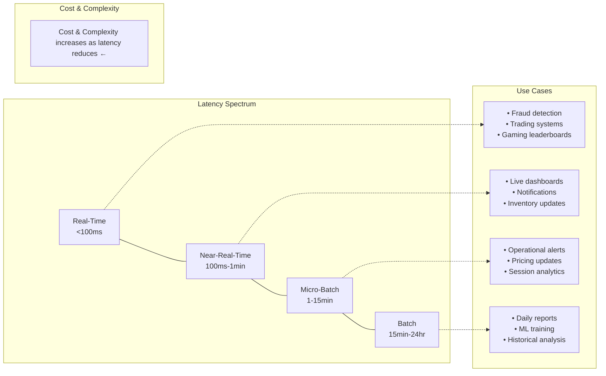
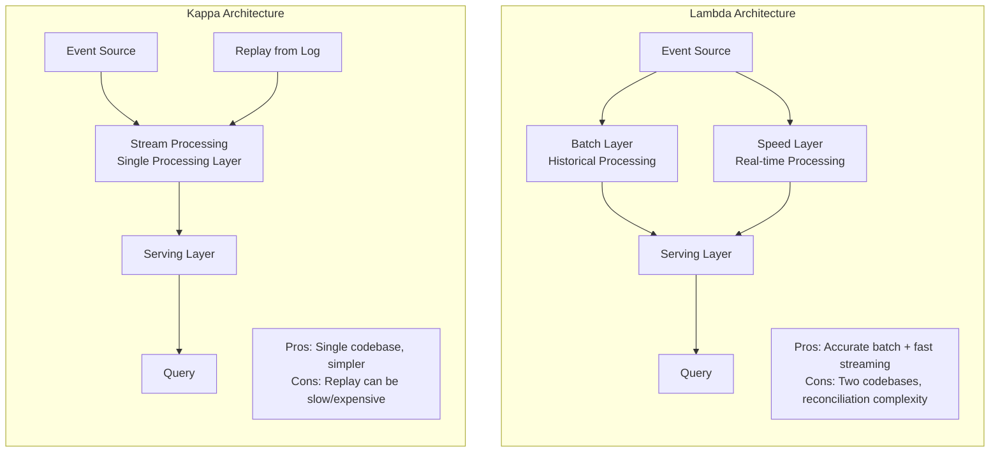
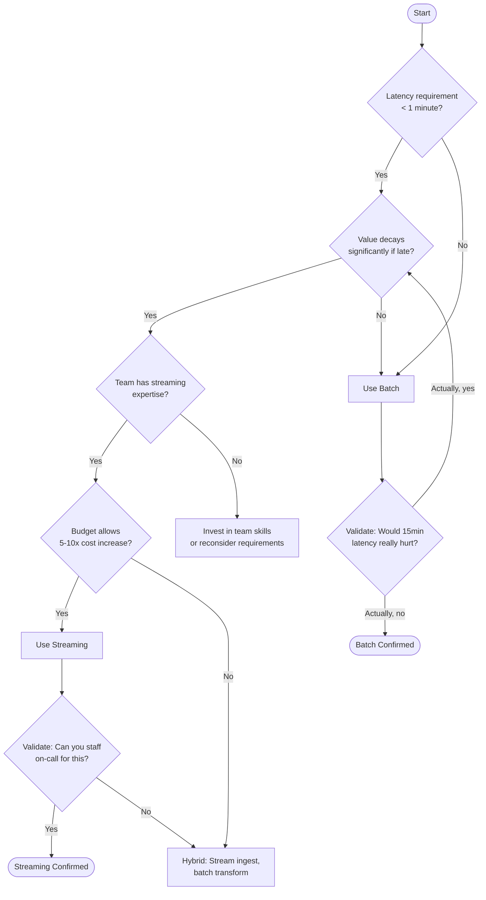

import { Aside, Card, CardGrid, Tabs, TabItem, Steps, Code } from '@astrojs/starlight/components';

## 3.1 Defining the Spectrum

<Aside type="caution">
The batch vs streaming dichotomy is false. What you have in reality is a spectrum:
</Aside>

| Tier | Latency | Example Use Cases | Typical Technologies |
|------|---------|-------------------|---------------------|
| **True Real-Time** | < 100ms | Fraud detection, trading, gaming | Flink, custom solutions |
| **Near-Real-Time** | 100ms - 1min | Live dashboards, notifications | Kafka + Flink, Spark Streaming |
| **Micro-Batch** | 1 - 15 min | Operational reporting, alerting | Spark Streaming, scheduled jobs |
| **Batch** | 15min - 24hr | Daily reports, ML training, historical analysis | Airflow + Spark, dbt |



## 3.2 When Batch is the Right Answer

<Aside type="tip" title="Default to Batch">
This is contrarian advice in an industry enamored with real-time, but it's correct for most use cases.
</Aside>

Batch is right when:

<Steps>

1. **Business decisions are made on daily/weekly cycles**: If nobody acts on data faster than daily, why process it faster?

2. **Correctness matters more than speed**: Batch allows for retries, validation, and reconciliation

3. **Cost is a constraint**: Streaming infrastructure costs 5-10x more to operate

4. **Team is small**: Streaming requires specialized expertise to operate reliably

5. **Data volume is predictable**: Batch handles bursty loads more gracefully

</Steps>

<Aside type="danger" title="War Story">
A retail company spent $2M building a real-time inventory system. Business requirement: "We need to know stock levels in real-time." Actual usage: Buyers checked stock levels once per morning meeting. The 15-minute batch job they had before was perfectly adequate. The real-time system added complexity, cost, and failure modes without changing any business outcome.
</Aside>

## 3.3 When Streaming is Essential

Streaming is essential when:

<CardGrid>
  <Card title="Decisions Must Be Made Within Seconds" icon="rocket">
    Fraud detection, security alerts
  </Card>
  <Card title="Value of Data Decays Rapidly" icon="clock">
    Social media trending, dynamic pricing
  </Card>
  <Card title="Downstream Systems Require Continuous Input" icon="forward-slash">
    Real-time recommendations, operational automation
  </Card>
  <Card title="You Can't Reprocess" icon="error">
    The action must happen now or not at all
  </Card>
</CardGrid>

### The Streaming Litmus Test

<Steps>

1. If this data arrived 15 minutes late, what business value would be lost?

2. If the answer is "significant revenue" or "regulatory violation," consider streaming

3. If the answer is "someone would have to wait for their dashboard," use batch

</Steps>

## 3.4 Lambda vs Kappa Architecture



<Tabs>
  <TabItem label="Lambda Architecture (circa 2011)" icon="puzzle">
    Run parallel batch and streaming pipelines. Merge results in serving layer. Two systems, two codebases, two sources of bugs.
  </TabItem>
  <TabItem label="Kappa Architecture (circa 2014)" icon="rocket">
    Use streaming for everything. Treat batch as just a very slow stream. Replay from the log when you need to reprocess.
  </TabItem>
  <TabItem label="Modern Reality (2024)" icon="approve-check">
    Most organizations use a pragmatic hybrid:
    - Streaming for genuinely time-sensitive use cases
    - Batch for everything else
    - Well-defined handoff points between the two
    
    Use what makes sense for your latency requirements and team capabilities.
  </TabItem>
</Tabs>

## 3.5 The Hidden Complexity of Streaming

<Aside type="caution">
Streaming looks simple in diagrams but is actually hard in production.
</Aside>

### Exactly-Once Semantics

**The problem**: Messages can be lost (at-most-once) or duplicated (at-least-once). Achieving exactly-once requires coordination between producer, broker, and consumer.

**The reality**: True exactly-once is expensive and often unnecessary. Many use cases tolerate at-least-once with idempotent processing.

### Late-Arriving Data

**The problem**: An event that happened at 2:00 PM might arrive at 2:15 PM. Do you:
- Drop it? (Lose data)
- Include it in the 2:00 PM window? (Reprocess and republish)
- Include it in the 2:15 PM window? (Incorrect aggregation)

**The solution**: Watermarks—a declaration of "I believe I've seen all events up to time T." But watermarks are heuristics, not guarantees.

```python
# Flink example: Handling late data with allowed lateness
from pyflink.datastream import StreamExecutionEnvironment
from pyflink.datastream.window import TumblingEventTimeWindows
from pyflink.common.time import Time

env = StreamExecutionEnvironment.get_execution_environment()

# Allow events up to 5 minutes late
stream \
    .key_by(lambda x: x.user_id) \
    .window(TumblingEventTimeWindows.of(Time.minutes(1))) \
    .allowed_lateness(Time.minutes(5)) \
    .side_output_late_data(late_output_tag) \
    .aggregate(CountAggregator())
```

### State Management

Streaming aggregations require state: counters, windows, session data. State must be:

<CardGrid>
  <Card title="Durable" icon="approve-check">
    Survive failures
  </Card>
  <Card title="Consistent" icon="setting">
    Checkpointed atomically
  </Card>
  <Card title="Scalable" icon="rocket">
    Distributed across workers
  </Card>
  <Card title="Fast" icon="forward-slash">
    Accessible without killing latency
  </Card>
</CardGrid>

<Aside type="danger">
This is hard. Flink's managed state is excellent but complex. Rolling your own is a recipe for data loss.
</Aside>

## 3.6 Tools Landscape

| Category | Batch | Streaming | Hybrid |
|----------|-------|-----------|--------|
| **Orchestration** | Airflow, Dagster, Prefect | N/A (streaming is continuous) | Dagster (native asset-based) |
| **Processing** | Spark (batch), dbt | Flink, Kafka Streams, Spark Streaming | Flink (unified batch/stream) |
| **Messaging** | N/A | Kafka, Pulsar, Kinesis | Kafka (batch consumption possible) |
| **Storage** | Data Warehouse, Data Lake | Kafka (short-term), specialized stores | Lakehouse (Delta, Iceberg) |

### Orchestration: Airflow vs Dagster

<Tabs>
  <TabItem label="Airflow: Task-Centric" icon="list-format">
    ```python
    # Airflow: Task-centric DAG definition
    from airflow import DAG
    from airflow.operators.python import PythonOperator
    from datetime import datetime

    with DAG('daily_etl', start_date=datetime(2024, 1, 1), schedule='@daily') as dag:
        
        extract = PythonOperator(
            task_id='extract',
            python_callable=extract_data,
            retries=3,
            retry_delay=timedelta(minutes=5)
        )
        
        transform = PythonOperator(
            task_id='transform',
            python_callable=transform_data
        )
        
        load = PythonOperator(
            task_id='load',
            python_callable=load_data
        )
        
        extract >> transform >> load
    ```
    
    Industry standard. Large ecosystem. Task-centric (define what to do, not what to produce). Excellent for complex dependencies. Steeper learning curve.
  </TabItem>
  <TabItem label="Dagster: Asset-Centric" icon="document">
    ```python
    # Dagster: Asset-centric definition
    from dagster import asset, Definitions

    @asset
    def raw_orders():
        """Extract orders from source system."""
        return extract_orders()

    @asset
    def clean_orders(raw_orders):
        """Clean and validate order data."""
        return clean_data(raw_orders)

    @asset
    def order_metrics(clean_orders):
        """Calculate order-level metrics."""
        return calculate_metrics(clean_orders)

    defs = Definitions(assets=[raw_orders, clean_orders, order_metrics])
    ```
    
    Asset-centric (define what you're producing). Better data lineage. Easier testing. Smaller ecosystem. Growing rapidly.
  </TabItem>
</Tabs>

## 3.7 Batch vs Streaming Decision Framework



### Key Takeaways

<CardGrid>
  <Card title="Default to Batch" icon="approve-check">
    Streaming is expensive and complex
  </Card>
  <Card title="Latency Spectrum" icon="clock">
    The latency spectrum is continuous—choose the tier that matches business value
  </Card>
  <Card title="Streaming Complexity" icon="warning">
    Late-arriving data, exactly-once semantics, and state management are the hard parts of streaming
  </Card>
  <Card title="Pragmatic Hybrids" icon="puzzle">
    Lambda architecture is largely obsolete; use pragmatic hybrids
  </Card>
</CardGrid>

### Reflection Questions

<Steps>

1. What's the fastest-moving business decision in your organization? How quickly does data need to arrive to inform it?

2. If your streaming pipeline went down for an hour, what business impact would occur?

3. How would you explain to a CFO why streaming costs 5-10x more than batch?

</Steps>
