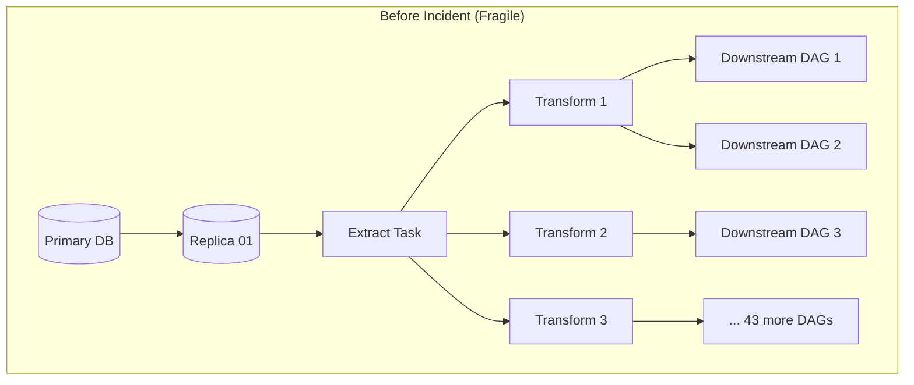
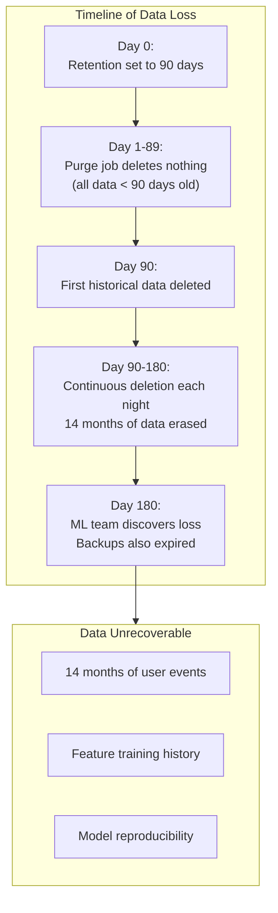

import { Aside, Card, CardGrid, Tabs, TabItem, Steps, Code } from '@astrojs/starlight/components';

## 4.1 How to Read Engineering Postmortems

<Aside type="tip">
Postmortems are the most underutilized learning resource in engineering. A well-written postmortem contains:
</Aside>

<Steps>

1. **What actually happened** (timeline, facts)

2. **Why it happened** (root cause, contributing factors)

3. **What we learned** (systemic issues)

4. **What we'll change** (preventive measures)

</Steps>

<Aside type="note">
The key skill is reading *between* the lines. The stated root cause is often a proximate cause. The real root cause is usually systemic: missing testing, inadequate monitoring, insufficient documentation, or organizational dysfunction.
</Aside>

## 4.2 Anatomy of a Postmortem

```
## Incident Summary
- Date: 2024-03-15
- Duration: 4 hours 23 minutes
- Severity: P1 (Revenue-impacting)
- Impact: 847,000 orders processed with incorrect pricing

## Timeline
- 14:32 UTC: Deployment of pricing service v2.3.4
- 14:47 UTC: First customer complaint received
- 15:12 UTC: Incident declared, investigation begins
- 16:45 UTC: Root cause identified
- 17:03 UTC: Rollback initiated
- 18:55 UTC: Rollback complete, verification in progress

## Root Cause
Schema change in pricing API response removed deprecated `discount_rate` 
field. Data pipeline defaulted to 0 when field was missing, applying 
no discounts to any orders.

## Contributing Factors
1. No schema validation on ingestion
2. Upstream team did not notify downstream consumers
3. No data quality alert on discount_rate distribution
4. Rollback process required manual intervention

## Remediation
- Immediate: Manual correction of 847,000 orders ($2.3M adjustments)
- Short-term: Add schema validation with explicit failure on missing fields
- Long-term: Implement schema registry with breaking change detection
```

## 4.3 Case Study 1: Silent Data Corruption from Schema Evolution

### The Alert/Symptom

<Aside type="danger" title="Wednesday, 9:47 AM">
Finance team opens ticket: "March revenue numbers don't match between dashboard and ERP system. Delta is $4.7M."
</Aside>

### Initial Investigation

```sql
-- Compare dashboard source table to ERP extract
SELECT 
    DATE_TRUNC('month', order_date) as month,
    SUM(total_amount) as dashboard_revenue,
    (SELECT SUM(amount) FROM erp_extract WHERE month = '2024-03') as erp_revenue
FROM orders
WHERE order_date >= '2024-03-01' AND order_date < '2024-04-01'
GROUP BY 1;
```

Results show dashboard is lower. Investigation focus: missing orders.

```sql
-- Check order counts
SELECT COUNT(*) FROM orders WHERE order_date >= '2024-03-01'; -- 2.3M
SELECT COUNT(*) FROM erp_extract WHERE month = '2024-03'; -- 2.3M
-- Same count. Not missing orders.
```

Pivot to data values:

```sql
-- Sample comparison
SELECT 
    o.order_id,
    o.total_amount as dashboard_amount,
    e.amount as erp_amount
FROM orders o
JOIN erp_extract e ON o.order_id = e.order_id
WHERE o.total_amount != e.amount
LIMIT 100;
```

**Finding**: 340,000 orders have `total_amount = 0` in dashboard but correct values in ERP.

### Root Cause Analysis

```sql
-- When did zeros start appearing?
SELECT 
    DATE(ingested_at) as ingest_date,
    COUNT(*) as total_orders,
    SUM(CASE WHEN total_amount = 0 THEN 1 ELSE 0 END) as zero_amount_orders
FROM orders
WHERE order_date >= '2024-02-01'
GROUP BY 1
ORDER BY 1;
```

**Finding**: Zero amounts started appearing March 3rd.

Checked deployment logs: March 2nd, upstream orders API was updated.

Checked API response diff:

```json
// Before March 2nd
{"order_id": "123", "total": {"amount": 99.99, "currency": "USD"}}

// After March 2nd  
{"order_id": "123", "total_amount": {"value": 99.99, "currency": "USD"}}
```

The field was renamed from `total.amount` to `total_amount.value`. Our extraction code:

```python
# Pipeline code (problematic)
def extract_order(response):
    return {
        'order_id': response['order_id'],
        'total_amount': response.get('total', {}).get('amount', 0)  # Silent default!
    }
```

<Aside type="danger">
When the field path changed, `.get('total', {}).get('amount', 0)` returned 0 instead of failing.
</Aside>

### The Fix

<Tabs>
  <TabItem label="Immediate" icon="rocket">
    ```sql
    -- Backfill from ERP as source of truth
    UPDATE orders o
    SET total_amount = e.amount
    FROM erp_extract e
    WHERE o.order_id = e.order_id
      AND o.order_date >= '2024-03-03'
      AND o.total_amount = 0;
    -- Updated 340,847 rows
    ```
  </TabItem>
  <TabItem label="Short-term" icon="setting">
    ```python
    # Pipeline code (fixed)
    def extract_order(response):
        # Explicit validation - fail loudly on missing fields
        if 'total_amount' not in response:
            raise SchemaValidationError(f"Missing 'total_amount' in response: {response}")
        
        total = response['total_amount']
        if 'value' not in total:
            raise SchemaValidationError(f"Missing 'value' in total_amount: {total}")
        
        return {
            'order_id': response['order_id'],
            'total_amount': total['value']
        }
    ```
  </TabItem>
  <TabItem label="Long-term" icon="approve-check">
    - Implemented schema registry with versioning
    - Added data quality checks for statistical anomalies
    - Established upstream notification SLA for breaking changes
  </TabItem>
</Tabs>

### Lessons Learned

<CardGrid>
  <Card title="Never Silently Default" icon="error">
    Never silently default on critical fields - Fail loudly, not silently
  </Card>
  <Card title="Monitor Distributions" icon="magnifier">
    Monitor data distributions, not just data presence - Zeros were present; the distribution was wrong
  </Card>
  <Card title="Consumer Registry" icon="document">
    Upstream teams don't know who consumes their data - Create a consumer registry
  </Card>
</CardGrid>

### Diagnostic Commands Used

```bash
# Check when pipeline config last changed
git log --oneline --since="2024-02-01" -- pipelines/orders/

# Verify API response schema
curl -s https://api.internal/orders/sample | jq 'keys'

# Check pipeline logs for warnings
grep -i "warning\|missing\|default" /var/log/pipelines/orders/2024-03-03.log
```

## 4.4 Case Study 2: Pipeline Cascade Failure from Single Point of Failure

### The Alert/Symptom

<Aside type="danger" title="Friday, 11:23 PM">
PagerDuty alert storm. 47 pipeline failure alerts within 3 minutes. On-call engineer's phone battery dies from vibrations.
</Aside>

### Initial Investigation

```bash
# Check Airflow dashboard
# Result: 47 DAGs in failed state, all with "upstream_failed" status

# Find the common ancestor
airflow tasks list daily_user_metrics --tree | head -20
```

All failures traced back to single DAG: `raw_events_ingestion`.

```bash
# Check the failing task
airflow tasks logs raw_events_ingestion extract_events 2024-03-15

# Output:
# ERROR - Connection refused: events-db-replica-01.internal:5432
# ERROR - Retry 1/3 failed
# ERROR - Retry 2/3 failed  
# ERROR - Retry 3/3 failed
# ERROR - Task failed with exception
```

### Root Cause Analysis

```bash
# Check database status
psql -h events-db-replica-01.internal -c "SELECT 1"
# Connection refused

# Check if host is up
ping events-db-replica-01.internal
# Host unreachable

# Check AWS console
aws rds describe-db-instances --db-instance-identifier events-db-replica-01
# Status: "storage-full"
```

<Aside type="caution">
The read replica ran out of disk space due to a bloated temporary table from an analyst's runaway query. When the replica went down, the single extraction task that depended on it failed. That task was upstream of 46 other DAGs.
</Aside>

Architecture diagram revealed the problem:



**Single point of failure**: One replica, one extract task, 47 dependent DAGs.

### The Fix

<Tabs>
  <TabItem label="Immediate" icon="rocket">
    ```bash
    # Resize replica storage (emergency)
    aws rds modify-db-instance \
        --db-instance-identifier events-db-replica-01 \
        --allocated-storage 500 \
        --apply-immediately

    # Wait for replica to come back online (took 45 minutes)

    # Clear failed states and retry
    airflow dags backfill --reset-dagruns -s 2024-03-15 -e 2024-03-15 raw_events_ingestion
    ```
  </TabItem>
  <TabItem label="Short-term" icon="setting">
    ```python
    # Modified extraction task with failover
    def extract_events(**context):
        replicas = [
            'events-db-replica-01.internal',
            'events-db-replica-02.internal',
            'events-db-primary.internal'  # Fallback to primary as last resort
        ]
        
        for replica in replicas:
            try:
                conn = connect_with_timeout(replica, timeout=30)
                return extract_from_connection(conn)
            except ConnectionError as e:
                logger.warning(f"Failed to connect to {replica}: {e}")
                continue
        
        raise AllReplicasFailedError("All database replicas unavailable")
    ```
  </TabItem>
  <TabItem label="Long-term" icon="approve-check">
    ```mermaid
    flowchart TD
        subgraph "After Remediation (Resilient)"
            DB1[(Primary DB)] --> R1[(Replica 01)]
            DB1 --> R2[(Replica 02)]
            
            R1 --> LB[Load Balancer]
            R2 --> LB
            
            LB --> Extract[Extract Task]
            
            Extract --> Buffer[(Landing Zone<br/>S3 Parquet)]
            
            Buffer --> T1[Transform 1]
            Buffer --> T2[Transform 2]
            Buffer --> T3[Transform 3]
            
            T1 --> D1[Downstream DAGs]
            T2 --> D1
            T3 --> D1
        end
    ```
    
    Architecture changes:
    1. Added second read replica
    2. Implemented connection load balancing with health checks
    3. Introduced landing zone buffer (S3) to decouple extraction from transformation
    4. Added storage monitoring with alerts at 70%, 85%, 95%
  </TabItem>
</Tabs>

### Lessons Learned

<CardGrid>
  <Card title="Find SPOFs Proactively" icon="magnifier">
    Every pipeline has a single point of failure until you find it - Actively hunt for them
  </Card>
  <Card title="Buffers Prevent Cascades" icon="approve-check">
    Buffers and decoupling prevent cascade failures - Don't chain tasks directly
  </Card>
  <Card title="Monitor Resources" icon="setting">
    Monitor resources, not just task status - Disk space, memory, connections
  </Card>
  <Card title="Design Smell" icon="warning">
    47 DAGs depending on one task is a design smell - Refactor into isolated stages
  </Card>
</CardGrid>

### Diagnostic Commands Used

```bash
# Find all downstream dependencies
airflow dags show raw_events_ingestion --save deps.png

# Count affected DAGs
airflow dags list-runs -d raw_events_ingestion -s 2024-03-15 --state failed | wc -l

# Check disk space on RDS
aws cloudwatch get-metric-statistics \
    --namespace AWS/RDS \
    --metric-name FreeStorageSpace \
    --dimensions Name=DBInstanceIdentifier,Value=events-db-replica-01 \
    --start-time 2024-03-15T00:00:00Z \
    --end-time 2024-03-16T00:00:00Z \
    --period 300 \
    --statistics Average
```

## 4.5 Case Study 3: Data Latency SLA Breach During Peak Load

### The Alert/Symptom

<Aside type="danger" title="Black Friday, 2:34 PM">
Operations team escalation: "Real-time inventory dashboard showing data from 45 minutes ago. Stores are overselling."
</Aside>

### Initial Investigation

```sql
-- Check data freshness in serving layer
SELECT 
    MAX(event_timestamp) as latest_event,
    MAX(processed_at) as latest_processed,
    CURRENT_TIMESTAMP - MAX(event_timestamp) as data_lag
FROM inventory_current;

-- Result:
-- latest_event: 2024-11-29 13:47:22
-- latest_processed: 2024-11-29 13:52:18
-- data_lag: 00:47:16
```

Data is 47 minutes stale. SLA is 5 minutes.

```bash
# Check Kafka consumer lag
kafka-consumer-groups --bootstrap-server kafka:9092 \
    --group inventory-processor \
    --describe

# Output:
# TOPIC              PARTITION  CURRENT-OFFSET  LOG-END-OFFSET  LAG
# inventory-events   0          45892012        48921847        3029835
# inventory-events   1          44521098        47891204        3370106
# inventory-events   2          46102384        49201847        3099463
# Total lag: 9,499,404 messages
```

<Aside type="danger">
9.5 million messages behind. Normal lag is under 1,000.
</Aside>

### Root Cause Analysis

```bash
# Check consumer instance metrics
kubectl top pods -l app=inventory-processor

# Output:
# NAME                      CPU     MEMORY
# inventory-processor-0     982m    3.8Gi  (limit: 4Gi)
# inventory-processor-1     978m    3.9Gi
# inventory-processor-2     995m    3.7Gi
```

All pods at CPU limit. Checked throughput:

```bash
# Calculate processing rate
kafka-consumer-groups --bootstrap-server kafka:9092 \
    --group inventory-processor \
    --describe | awk 'NR>1 {sum += $5} END {print sum}'
    
# Run again after 60 seconds, calculate delta
# Result: Processing 2,400 messages/second
# Incoming rate on Black Friday: 8,500 messages/second
```

<Aside type="caution">
Processing at 28% of incoming rate. Falling further behind every second.
</Aside>

**Root cause**: Kafka consumer instances were not configured to auto-scale. Fixed pod count of 3 was sized for normal traffic (2,000 msg/sec), not Black Friday traffic (8,500 msg/sec).

### The Fix

<Tabs>
  <TabItem label="Immediate" icon="rocket">
    ```bash
    # Emergency scale-up
    kubectl scale deployment inventory-processor --replicas=12

    # Increase consumer parallelism (required Kafka partition increase)
    # Kafka topic had 3 partitions = max 3 parallel consumers
    # Need to increase partitions

    kafka-topics --bootstrap-server kafka:9092 \
        --topic inventory-events \
        --alter \
        --partitions 12

    # Restart consumers to rebalance
    kubectl rollout restart deployment inventory-processor
    ```
    
    ```bash
    # Monitor recovery
    watch -n 5 'kafka-consumer-groups --bootstrap-server kafka:9092 \
        --group inventory-processor --describe | tail -1'

    # Lag decreased from 9.5M to 0 over 23 minutes
    ```
  </TabItem>
  <TabItem label="Short-term" icon="setting">
    ```yaml
    # Kubernetes HPA configuration
    apiVersion: autoscaling/v2
    kind: HorizontalPodAutoscaler
    metadata:
      name: inventory-processor-hpa
    spec:
      scaleTargetRef:
        apiVersion: apps/v1
        kind: Deployment
        name: inventory-processor
      minReplicas: 3
      maxReplicas: 20
      metrics:
      - type: External
        external:
          metric:
            name: kafka_consumer_lag
            selector:
              matchLabels:
                consumer_group: inventory-processor
          target:
            type: AverageValue
            averageValue: "10000"  # Scale up when lag > 10k per pod
    ```
  </TabItem>
  <TabItem label="Long-term" icon="approve-check">
    - Pre-provisioned capacity for known peak events (Black Friday, Prime Day)
    - Implemented backpressure mechanisms to gracefully degrade
    - Created runbook for traffic spike scenarios
    - Added lag-based alerting with tiered thresholds
  </TabItem>
</Tabs>

### Lessons Learned

<CardGrid>
  <Card title="Partition Limits" icon="warning">
    Kafka partitions = maximum parallelism - Can't scale consumers beyond partition count
  </Card>
  <Card title="Peak Load Testing" icon="rocket">
    Load testing must include peak scenarios - Normal load tests don't find peak failures
  </Card>
  <Card title="Test Auto-scaling" icon="setting">
    Auto-scaling must be tested - Configured but never triggered ≠ working
  </Card>
  <Card title="Pre-scale for Known Peaks" icon="approve-check">
    Known peak events should be pre-scaled - Don't rely on auto-scaling for predictable spikes
  </Card>
</CardGrid>

### Diagnostic Commands Used

```bash
# Real-time lag monitoring
kafka-consumer-groups --bootstrap-server kafka:9092 \
    --group inventory-processor \
    --describe 2>/dev/null | \
    awk 'NR>1 {lag += $5} END {print strftime("%H:%M:%S"), "Lag:", lag}'

# Producer rate calculation
kafka-run-class kafka.tools.GetOffsetShell \
    --broker-list kafka:9092 \
    --topic inventory-events \
    --time -1 | awk -F: '{sum += $3} END {print sum}'
# Run twice, 60 seconds apart, calculate delta

# Check for consumer rebalancing issues
kubectl logs -l app=inventory-processor --since=1h | grep -i rebalance
```

## 4.6 Case Study 4: Incorrect Business Metrics from Duplicate Event Processing

### The Alert/Symptom

<Aside type="danger" title="Monday, 10:15 AM">
CEO asks in Slack: "Why does the investor dashboard show we did $47M in GMV yesterday when finance says it was $31M?"
</Aside>

### Initial Investigation

```sql
-- Compare aggregate numbers
SELECT 
    SUM(order_value) as dashboard_gmv
FROM analytics.daily_gmv
WHERE date = '2024-03-17';
-- Result: 47,234,891.23

SELECT 
    SUM(amount) as finance_gmv  
FROM finance.reconciled_orders
WHERE order_date = '2024-03-17';
-- Result: 31,421,847.56

-- Delta: $15.8M (50% inflation!)
```

```sql
-- Check for duplicates
SELECT 
    order_id, 
    COUNT(*) as occurrences
FROM analytics.orders_raw
WHERE order_date = '2024-03-17'
GROUP BY order_id
HAVING COUNT(*) > 1
ORDER BY COUNT(*) DESC
LIMIT 10;

-- Result:
-- order_id          | occurrences
-- ORD-2024-8847123  | 3
-- ORD-2024-8847124  | 3
-- ORD-2024-8847125  | 3
-- ... (pattern continues)
```

<Aside type="danger">
Massive duplication. Every order from a specific time window is tripled.
</Aside>

### Root Cause Analysis

```sql
-- Find when duplicates started
SELECT 
    DATE_TRUNC('hour', ingested_at) as hour,
    COUNT(*) as records,
    COUNT(DISTINCT order_id) as unique_orders,
    COUNT(*) / COUNT(DISTINCT order_id)::float as duplication_ratio
FROM analytics.orders_raw
WHERE order_date = '2024-03-17'
GROUP BY 1
ORDER BY 1;

-- Result shows duplication_ratio of 3.0 from 02:00 to 05:00
```

Checked Kafka consumer offset commits:

```bash
# Examine consumer offset history
kafka-consumer-groups --bootstrap-server kafka:9092 \
    --group orders-analytics-consumer \
    --describe --offsets --verbose

# Check consumer logs
kubectl logs orders-processor-pod --since=24h | grep -i "offset\|commit\|rebalance"
```

**Finding**: Consumer group experienced three rebalances between 02:00 and 05:00 due to pod evictions. Each rebalance caused consumers to restart from the last committed offset. Offset commits were configured to occur every 5 minutes, but processing a batch took 7 minutes.

```
Timeline:
02:00 - Consumer reads messages 1000-2000, starts processing
02:05 - Offset commit scheduled but processing not complete (no commit)
02:07 - Pod evicted (memory pressure), processing interrupted
02:08 - New pod starts, reads from last committed offset (1000)
02:08 - Messages 1000-2000 processed AGAIN
02:15 - Another eviction... (cycle repeats)
```

<Aside type="caution" title="Root Cause">
At-least-once delivery combined with non-idempotent aggregation. Messages were processed multiple times, and the aggregation logic summed all occurrences instead of deduplicating.
</Aside>

### The Fix

<Tabs>
  <TabItem label="Immediate" icon="rocket">
    ```sql
    -- Rebuild daily_gmv with deduplication
    CREATE OR REPLACE TABLE analytics.daily_gmv_fixed AS
    WITH deduplicated_orders AS (
        SELECT DISTINCT ON (order_id)
            order_id,
            order_date,
            order_value,
            ingested_at
        FROM analytics.orders_raw
        WHERE order_date = '2024-03-17'
        ORDER BY order_id, ingested_at ASC  -- Take first occurrence
    )
    SELECT 
        order_date as date,
        SUM(order_value) as gmv,
        COUNT(*) as order_count
    FROM deduplicated_orders
    GROUP BY order_date;

    -- Verify fix
    SELECT * FROM analytics.daily_gmv_fixed;
    -- Result: 31,421,847.56 ✓ (matches finance)
    ```
  </TabItem>
  <TabItem label="Short-term (Python)" icon="seti:python">
    ```python
    # Before: Non-idempotent aggregation
    def aggregate_orders(orders_df):
        return orders_df.groupby('date').agg({
            'order_value': 'sum',
            'order_id': 'count'
        })

    # After: Idempotent aggregation with deduplication
    def aggregate_orders(orders_df):
        # Deduplicate first, then aggregate
        deduplicated = orders_df.drop_duplicates(
            subset=['order_id'], 
            keep='first'
        )
        return deduplicated.groupby('date').agg({
            'order_value': 'sum',
            'order_id': 'count'
        })
    ```
  </TabItem>
  <TabItem label="Short-term (dbt)" icon="seti:sql">
    ```sql
    -- Better: Deduplication in dbt model
    -- models/marts/daily_gmv.sql
    WITH source AS (
        SELECT * FROM {{ ref('stg_orders') }}
    ),

    deduplicated AS (
        SELECT *,
            ROW_NUMBER() OVER (
                PARTITION BY order_id 
                ORDER BY ingested_at ASC
            ) as rn
        FROM source
    ),

    unique_orders AS (
        SELECT * FROM deduplicated WHERE rn = 1
    )

    SELECT
        order_date as date,
        SUM(order_value) as gmv,
        COUNT(*) as order_count,
        CURRENT_TIMESTAMP as calculated_at
    FROM unique_orders
    GROUP BY order_date
    ```
  </TabItem>
  <TabItem label="Long-term" icon="approve-check">
    ```yaml
    # Kafka consumer configuration fixes
    # 1. More frequent offset commits
    enable.auto.commit: true
    auto.commit.interval.ms: 1000  # Every 1 second instead of 5 minutes

    # 2. Or better: manual commits after successful processing
    enable.auto.commit: false
    # Commit offsets explicitly after each batch is fully processed
    ```
    
    ```python
    # Manual offset commit after successful processing
    def process_batch(consumer, messages):
        try:
            # Process all messages
            processed_records = transform(messages)
            
            # Write to target
            write_to_warehouse(processed_records)
            
            # Only commit AFTER successful write
            consumer.commit()
            
        except Exception as e:
            logger.error(f"Batch processing failed: {e}")
            # Don't commit - messages will be reprocessed
            # But our aggregation is now idempotent, so this is safe
            raise
    ```
    
    ```yaml
    # Pod resource configuration to prevent evictions
    resources:
      requests:
        memory: "2Gi"
        cpu: "500m"
      limits:
        memory: "4Gi"
        cpu: "2000m"
    # Also: set PodDisruptionBudget to prevent simultaneous evictions
    ```
  </TabItem>
</Tabs>

### Lessons Learned

<CardGrid>
  <Card title="Idempotent Processing" icon="approve-check">
    At-least-once delivery requires idempotent processing - Always design for duplicates
  </Card>
  <Card title="Commit Timing" icon="clock">
    Offset commit timing is critical - Commit after processing, not on a timer
  </Card>
  <Card title="Deduplicate by Default" icon="setting">
    Aggregations should deduplicate by default - Make it impossible to double-count
  </Card>
  <Card title="Resource Pressure" icon="warning">
    Resource pressure causes unexpected reprocessing - Memory limits trigger evictions
  </Card>
</CardGrid>

### Diagnostic Commands Used

```sql
-- Find duplication rate by time window
SELECT 
    DATE_TRUNC('hour', ingested_at) as hour,
    ROUND(COUNT(*)::numeric / COUNT(DISTINCT order_id), 2) as dup_ratio
FROM analytics.orders_raw
WHERE order_date >= CURRENT_DATE - INTERVAL '7 days'
GROUP BY 1
ORDER BY 1 DESC;

-- Identify which orders are duplicated
SELECT order_id, array_agg(ingested_at ORDER BY ingested_at) as ingestion_times
FROM analytics.orders_raw
WHERE order_date = '2024-03-17'
GROUP BY order_id
HAVING COUNT(*) > 1
LIMIT 20;
```

```bash
# Check for consumer group rebalances
kafka-consumer-groups --bootstrap-server kafka:9092 \
    --group orders-analytics-consumer \
    --describe --state

# Check pod eviction events
kubectl get events --sort-by='.lastTimestamp' | grep -i evict
```

## 4.7 Case Study 5: Catastrophic Data Loss from Misconfigured Retention Policies

### The Alert/Symptom

<Aside type="danger" title="Thursday, 3:00 PM">
Data scientist opens urgent ticket: "All training data before January is gone. 14 months of historical data missing from the feature store."
</Aside>

### Initial Investigation

```sql
-- Check data availability
SELECT 
    DATE_TRUNC('month', event_date) as month,
    COUNT(*) as record_count
FROM feature_store.user_events
GROUP BY 1
ORDER BY 1;

-- Result:
-- month       | record_count
-- 2024-01     | 45,231,847
-- 2024-02     | 48,102,934
-- 2024-03     | 51,234,123
-- (no data before 2024-01!)
```

```sql
-- Verify this isn't a query issue
SELECT MIN(event_date), MAX(event_date) 
FROM feature_store.user_events;

-- Result: 2024-01-01, 2024-03-21
-- Confirmed: Data before 2024-01-01 is gone
```

Checked backup availability:

```bash
# List available backups
aws s3 ls s3://company-backups/feature-store/ --recursive | head -20

# Result: Only backups from last 30 days
# Backup retention was also set to 30 days!
```

### Root Cause Analysis

Investigated the data lifecycle configuration:

```bash
# Check table properties
aws glue get-table --database-name feature_store --name user_events

# Output included:
# "Parameters": {
#     "retention_days": "90",      # <-- This was the problem
#     "auto_purge": "true"
# }
```

```bash
# Check when this configuration was applied
git log --all --oneline -- infrastructure/glue/user_events.tf

# Found commit from 2 months ago:
# abc1234 "Reduce storage costs - set 90 day retention"
```

**The chain of events**:

<Steps>

1. FinOps initiative to reduce storage costs

2. Engineer set `retention_days: 90` on feature store tables

3. Configuration applied via Terraform

4. Background purge job ran nightly, deleting data older than 90 days

5. After 90 days, 14 months of historical data permanently gone

6. After 30 more days, backups of that data also gone

7. No one noticed until ML team needed historical data for retraining

</Steps>



### The Fix

<Tabs>
  <TabItem label="Immediate" icon="rocket">
    ```bash
    # STOP THE BLEEDING - Disable purge job immediately
    aws glue update-table \
        --database-name feature_store \
        --table-input '{"Name": "user_events", "Parameters": {"auto_purge": "false"}}'

    # Check what data remains
    aws s3 ls s3://feature-store-data/user_events/ --recursive | \
        awk '{print $4}' | cut -d'/' -f3 | sort -u | head -20
    ```
  </TabItem>
  <TabItem label="Attempted Recovery (Partially Successful)" icon="setting">
    ```bash
    # 1. Check if any replicas exist
    aws s3 ls s3://feature-store-replica/ --recursive  # Nothing

    # 2. Check if source systems still have data
    # Application database had 6 months of data (its own retention)
    # Recovered 6 months from application DB

    # 3. Check data lake raw zone
    aws s3 ls s3://data-lake-raw/events/ --recursive | head -20
    # Raw zone had NO retention policy - found 18 months of raw data!
    ```
    
    ```python
    # Rebuild feature store from raw data lake
    # This took 3 days of processing and validation

    from pyspark.sql import SparkSession

    spark = SparkSession.builder.appName("FeatureStoreRecovery").getOrCreate()

    # Read raw events (unprocessed, but present)
    raw_events = spark.read.parquet("s3://data-lake-raw/events/")

    # Apply feature engineering transformations
    features = (
        raw_events
        .filter("event_date >= '2022-11-01'")
        .transform(apply_feature_engineering)
        .transform(validate_schema)
    )

    # Write back to feature store
    features.write \
        .partitionBy("event_date") \
        .mode("append") \
        .parquet("s3://feature-store-data/user_events/")
    ```
  </TabItem>
  <TabItem label="Long-term (Terraform)" icon="seti:terraform">
    ```hcl
    # Terraform module for data lifecycle with safeguards
    # infrastructure/modules/data_table/main.tf

    variable "retention_days" {
      type        = number
      description = "Data retention period in days"
      
      validation {
        condition     = var.retention_days >= 365 || var.retention_days == 0
        error_message = "Retention must be at least 365 days or 0 (infinite). For shorter retention, use 'short_retention_days' with explicit approval."
      }
    }

    variable "short_retention_days" {
      type        = number
      default     = 0
      description = "Override for retention < 365 days. Requires approval tag."
    }

    variable "short_retention_approval" {
      type        = string
      default     = ""
      description = "JIRA ticket approving short retention policy"
      
      validation {
        condition     = var.short_retention_days == 0 || can(regex("^DATA-[0-9]+$", var.short_retention_approval))
        error_message = "Short retention requires a DATA-XXXX approval ticket."
      }
    }

    resource "aws_glue_table" "this" {
      # ... table configuration ...
      
      parameters = {
        retention_days              = coalesce(var.short_retention_days, var.retention_days)
        retention_approval_ticket   = var.short_retention_approval
        auto_purge                  = "true"
        
        # CRITICAL: These tables feed ML training
        critical_data_classification = var.is_ml_training_data ? "ML_TRAINING" : "STANDARD"
      }
    }
    ```
  </TabItem>
  <TabItem label="Long-term (Backup Policy)" icon="approve-check">
    ```yaml
    # Backup policy with safety margins
    # backup_policy.yaml

    backup_schedules:
      feature_store:
        frequency: daily
        retention_days: 730  # 2 years - MUST exceed data retention
        cross_region_copy: true
        immutable_period: 90  # Cannot be deleted for 90 days even intentionally
        
      raw_data_lake:
        frequency: weekly
        retention_days: 0  # Infinite - this is source of truth
        storage_class: GLACIER_DEEP_ARCHIVE
    ```
  </TabItem>
</Tabs>

### Lessons Learned

<CardGrid>
  <Card title="Backup > Data Retention" icon="approve-check">
    Backup retention must exceed data retention - Otherwise backups expire before you need them
  </Card>
  <Card title="Mandatory Review" icon="setting">
    Retention changes need mandatory review - Especially for ML training data
  </Card>
  <Card title="Keep Raw Data" icon="document">
    Keep raw data forever (or archive cheaply) - It's your recovery option
  </Card>
  <Card title="Test Recovery" icon="warning">
    Test recovery procedures - Untested backups are Schrödinger's backups
  </Card>
  <Card title="Data Classification" icon="information">
    Classify data by recovery requirements - ML training data is often irreplaceable
  </Card>
</CardGrid>

### Diagnostic Commands Used

```bash
# Audit retention settings across all tables
aws glue get-tables --database-name feature_store | \
    jq '.TableList[] | {name: .Name, retention: .Parameters.retention_days}'

# Check when data was deleted (CloudTrail)
aws cloudtrail lookup-events \
    --lookup-attributes AttributeKey=EventName,AttributeValue=DeleteObject \
    --start-time 2024-01-01 \
    --end-time 2024-03-21 | \
    jq '.Events[] | select(.Resources[].ResourceName | contains("user_events"))'

# Estimate storage of raw data lake
aws s3 ls s3://data-lake-raw/events/ --recursive --summarize | tail -2
```

## 4.8 Pattern Extraction: Systemic Issues Across Failures

Analyzing these five cases reveals recurring systemic issues:

| Pattern | Cases | Root Cause | Prevention |
|---------|-------|------------|------------|
| **Silent Defaults** | 1, 4 | Code defaults to zero/null instead of failing | Fail loudly on unexpected input |
| **Single Points of Failure** | 2, 3 | No redundancy in critical path | Design for failure at every layer |
| **Untested Scaling** | 3 | Auto-scaling configured but never triggered | Load test to breaking point |
| **Non-Idempotent Processing** | 4 | Duplicates cause incorrect aggregation | Design all operations to be idempotent |
| **Retention Misalignment** | 5 | Backup retention < data retention | Backup retention must exceed data retention |
| **Missing Validation** | 1, 4, 5 | No checks on data shape, volume, or distribution | Validate at every boundary |
| **Change Without Notification** | 1, 5 | Upstream/configuration changes break downstream | Schema contracts, change review processes |

### Key Takeaways

<CardGrid>
  <Card title="Systemic Issues" icon="magnifier">
    Every postmortem reveals systemic issues, not just proximate causes
  </Card>
  <Card title="Silent Failures" icon="error">
    Silent failures are more dangerous than loud failures
  </Card>
  <Card title="Multiple Factors" icon="puzzle">
    Most incidents involve multiple contributing factors
  </Card>
  <Card title="Prevention Requires Both" icon="approve-check">
    Prevention requires both technical safeguards and process changes
  </Card>
  <Card title="Find Patterns Early" icon="warning">
    The best time to find these patterns is before the incident
  </Card>
</CardGrid>

### Reflection Questions

<Steps>

1. Which of these five failure patterns is most likely to occur in your current systems?

2. If you had to bet, which of your pipelines would fail first under 10x load?

3. How would you know if data from 6 months ago was silently corrupted today?

</Steps>
