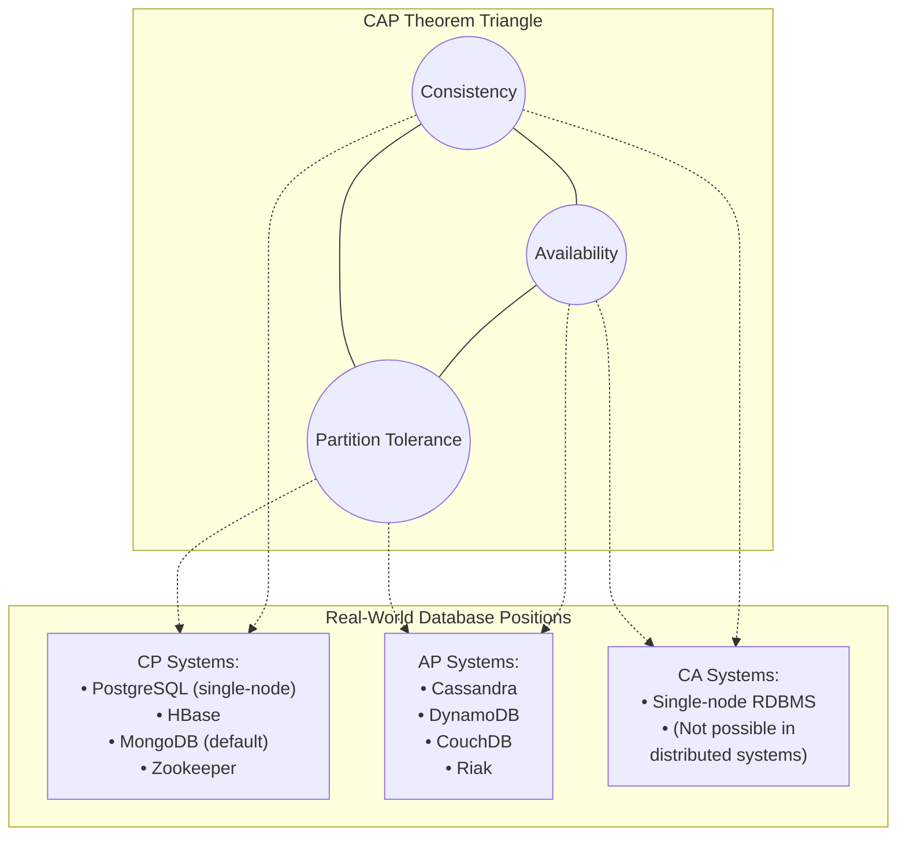
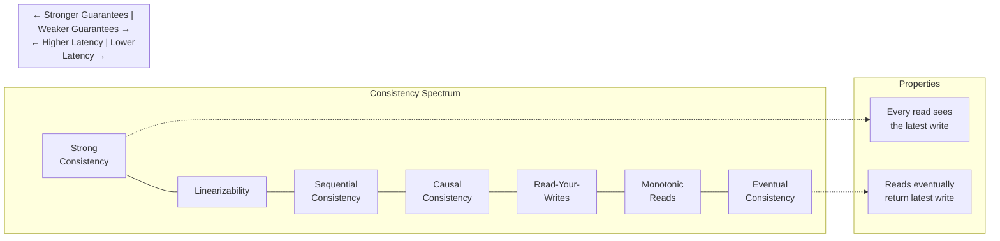

import { Aside, Card, CardGrid, Tabs, TabItem, Steps, Code } from '@astrojs/starlight/components';

## 5.1 CAP Theorem: The Fundamental Trade-off

The CAP theorem states that a distributed data store can provide at most two of three guarantees:

<CardGrid>
  <Card title="Consistency (C)" icon="approve-check">
    Every read receives the most recent write or an error
  </Card>
  <Card title="Availability (A)" icon="rocket">
    Every request receives a response (not an error)
  </Card>
  <Card title="Partition Tolerance (P)" icon="puzzle">
    The system continues to operate despite network partitions
  </Card>
</CardGrid>



<Aside type="tip" title="The Critical Insight">
In distributed systems, network partitions *will* happen. You cannot choose to avoid them. Therefore, the real choice is between **consistency** and **availability** when a partition occurs.
</Aside>

### Why You Can't Have All Three

Imagine two database nodes, A and B, that must stay synchronized. A network partition occurs—they can't communicate. A client writes to Node A. What happens when a client reads from Node B?

<Tabs>
  <TabItem label="Choose Consistency" icon="approve-check">
    Node B must reject the read (it might return stale data). System is unavailable.
  </TabItem>
  <TabItem label="Choose Availability" icon="rocket">
    Node B returns its (stale) data. System is inconsistent.
  </TabItem>
</Tabs>

<Aside type="note">
You cannot have both during a partition. This isn't a software limitation—it's a fundamental property of distributed systems.
</Aside>

## 5.2 Practical Implications for Data Platforms

| Scenario | Choose CP When... | Choose AP When... |
|----------|-------------------|-------------------|
| **Financial Transactions** | Account balances must never be wrong | Never (always choose CP) |
| **Inventory Systems** | Overselling has high cost | Underselling is acceptable |
| **User Sessions** | Session integrity is critical | Occasional re-login is acceptable |
| **Analytics Data** | Regulatory accuracy requirements | Dashboards can show slightly stale data |
| **Social Feeds** | Never (always choose AP) | Users expect instant updates |

### Decision Framework

```python
def choose_cap_trade_off(use_case):
    """
    Framework for choosing consistency vs availability.
    """
    questions = {
        "financial_impact_of_inconsistency": "HIGH/MEDIUM/LOW",
        "user_tolerance_for_unavailability": "HIGH/MEDIUM/LOW",
        "regulatory_requirements": "STRICT/MODERATE/NONE",
        "data_correction_cost": "HIGH/MEDIUM/LOW"
    }
    
    # If any of these are true, choose CP
    cp_indicators = [
        answers["financial_impact_of_inconsistency"] == "HIGH",
        answers["regulatory_requirements"] == "STRICT",
        answers["data_correction_cost"] == "HIGH"
    ]
    
    # If any of these are true, choose AP
    ap_indicators = [
        answers["user_tolerance_for_unavailability"] == "LOW",
        answers["financial_impact_of_inconsistency"] == "LOW",
        use_case in ["social_feeds", "activity_logs", "recommendations"]
    ]
    
    if any(cp_indicators):
        return "CP - Consistency over Availability"
    elif any(ap_indicators):
        return "AP - Availability over Consistency"
    else:
        return "Evaluate case-by-case with stakeholders"
```

## 5.3 PACELC: Extending CAP for Normal Operations

<Aside type="tip">
CAP only describes behavior during partitions. PACELC extends this to normal operations:
</Aside>

**PACELC**: If there is a **P**artition, choose between **A**vailability and **C**onsistency. **E**lse (normal operation), choose between **L**atency and **C**onsistency.

| System | During Partition (PAC) | Normal Operation (ELC) |
|--------|------------------------|------------------------|
| PostgreSQL | PC (unavailable during partition) | EC (consistent, higher latency for distributed reads) |
| Cassandra | PA (available, inconsistent) | EL (low latency, eventual consistency) |
| DynamoDB | PA (available) | EL (low latency by default) |
| Spanner | PC (consistent) | EC (consistent, moderate latency) |
| MongoDB | PA or PC (configurable) | EL or EC (configurable) |

<Aside type="note">
This explains why Cassandra is so fast for reads (EL) but might return stale data, while Spanner is slower but always correct.
</Aside>

## 5.4 Consistency Models Deep Dive

Not all "consistency" is equal. A spectrum exists:



<Tabs>
  <TabItem label="Strong Consistency" icon="approve-check">
    Every read receives the most recent write. If I write "balance = 100", every subsequent read—from any node—returns 100.
    
    **Systems**: PostgreSQL (single-node), Google Spanner, CockroachDB  
    **Cost**: Higher latency (must coordinate across nodes)
  </TabItem>
  <TabItem label="Linearizability" icon="setting">
    Strongest form of consistency. Operations appear to occur instantaneously at some point between their invocation and completion.
    
    **Systems**: Zookeeper, etcd  
    **Cost**: Very high latency for writes (consensus required)
  </TabItem>
  <TabItem label="Causal Consistency" icon="puzzle">
    If operation A causes operation B, everyone sees A before B. But concurrent operations may be seen in different orders.
    
    **Systems**: MongoDB (with causal sessions)  
    **Use case**: Chat applications where reply must appear after original message
  </TabItem>
  <TabItem label="Read-Your-Writes" icon="document">
    You always see your own writes, but may see stale data from others.
    
    **Systems**: Many databases support this as a session guarantee  
    **Use case**: User updates profile, immediately sees their changes
  </TabItem>
  <TabItem label="Eventual Consistency" icon="clock">
    If no new writes occur, eventually all reads return the last written value. No guarantee on when "eventually" is.
    
    **Systems**: Cassandra, DynamoDB (default), S3  
    **Cost**: Lowest latency, but readers may see stale data
  </TabItem>
</Tabs>

## 5.5 Real-World Examples

### Why Cassandra Works the Way It Does

Cassandra is designed for **availability and partition tolerance** (AP), sacrificing consistency.

```
Write path:
1. Client writes to coordinator node
2. Coordinator forwards to N replica nodes (typically 3)
3. Returns success when W nodes acknowledge (typically 2)
4. Third replica receives write eventually (async)

Read path:
1. Client reads from coordinator
2. Coordinator queries R replica nodes (typically 2)
3. Returns most recent value based on timestamp
4. Background repair fixes inconsistencies
```

<Aside type="tip" title="Tunable Consistency">
You can choose W (write) and R (read) levels.
- W=1, R=1: Fastest, least consistent
- W=QUORUM, R=QUORUM: Stronger consistency, higher latency
- W=ALL, R=ONE: Writes are slow but reads are consistent
</Aside>

```python
# Cassandra query with tunable consistency
from cassandra.cluster import Cluster
from cassandra.query import SimpleStatement
from cassandra import ConsistencyLevel

cluster = Cluster(['node1', 'node2', 'node3'])
session = cluster.connect('my_keyspace')

# Strong consistency - wait for quorum
statement = SimpleStatement(
    "SELECT * FROM users WHERE user_id = %s",
    consistency_level=ConsistencyLevel.QUORUM
)
result = session.execute(statement, [user_id])

# Weak consistency - fast but may be stale
statement_fast = SimpleStatement(
    "SELECT * FROM users WHERE user_id = %s",
    consistency_level=ConsistencyLevel.ONE
)
result_fast = session.execute(statement_fast, [user_id])
```

### Why Kafka Behaves As It Does

Kafka prioritizes **durability and ordering** over low latency.

```
Write path (producer):
1. Producer sends message to partition leader
2. Leader writes to local log
3. Followers replicate from leader
4. Producer receives ack based on `acks` setting:
   - acks=0: Don't wait (fastest, may lose data)
   - acks=1: Wait for leader (balanced)
   - acks=all: Wait for all in-sync replicas (safest, slowest)

Read path (consumer):
1. Consumer reads from partition leader (or follower with KIP-392)
2. Receives messages in strict order within partition
3. Must track offsets to handle failures
```

<Aside type="tip" title="Key Insight">
Kafka is a CP system. If partitions lose quorum, writes fail (unavailable). This ensures you never lose acknowledged messages.
</Aside>

```python
# Kafka producer with different durability settings
from kafka import KafkaProducer

# Maximum durability - wait for all replicas
producer_safe = KafkaProducer(
    bootstrap_servers=['kafka:9092'],
    acks='all',  # Wait for all in-sync replicas
    retries=3,
    max_in_flight_requests_per_connection=1  # Preserve order on retry
)

# Maximum throughput - don't wait for acks
producer_fast = KafkaProducer(
    bootstrap_servers=['kafka:9092'],
    acks=0,  # Fire and forget
    batch_size=65536,
    linger_ms=10
)
```

## 5.6 When Eventual Consistency Bites You

<Aside type="danger" title="War Story">
A user updates their email address. The write goes to Node A. The user immediately clicks "Send verification email." That request goes to Node B, which hasn't replicated yet. Verification email goes to the *old* address. User complains, "I just updated my email!"
</Aside>

### Symptoms of Eventual Consistency Issues

<CardGrid>
  <Card title="Just Saved" icon="warning">
    "I just saved this, why isn't it showing?"
  </Card>
  <Card title="Disappeared" icon="error">
    "The data was there a second ago, now it's gone"
  </Card>
  <Card title="Different Values" icon="puzzle">
    "Two users see different values for the same record"
  </Card>
  <Card title="Oscillating Data" icon="clock">
    Data that oscillates between values
  </Card>
</CardGrid>

### Mitigation Strategies

<Tabs>
  <TabItem label="1. Read-Your-Writes" icon="document">
    Route reads to same node as writes
    
    ```python
    class SessionStickyRouter:
        def __init__(self):
            self.session_to_node = {}
        
        def route_write(self, session_id, write_request):
            node = self.get_primary_node()
            self.session_to_node[session_id] = node
            return node.write(write_request)
        
        def route_read(self, session_id, read_request):
            # Read from same node we wrote to
            node = self.session_to_node.get(session_id, self.get_any_node())
            return node.read(read_request)
    ```
  </TabItem>
  <TabItem label="2. Synchronous Replication" icon="setting">
    Use strong consistency for critical paths
    
    ```python
    def update_email(user_id, new_email):
        # Use strong consistency for this critical operation
        result = db.execute(
            "UPDATE users SET email = %s WHERE id = %s",
            [new_email, user_id],
            consistency='strong'  # Wait for replication
        )
        return result

    def update_preferences(user_id, preferences):
        # Eventual consistency is fine for non-critical updates
        result = db.execute(
            "UPDATE user_preferences SET prefs = %s WHERE user_id = %s",
            [preferences, user_id],
            consistency='eventual'  # Don't wait
        )
        return result
    ```
  </TabItem>
  <TabItem label="3. Version Vectors" icon="approve-check">
    Conflict detection with version tracking
    
    ```python
    def update_with_version(user_id, field, value, expected_version):
        result = db.execute("""
            UPDATE users 
            SET {field} = %s, version = version + 1 
            WHERE id = %s AND version = %s
        """.format(field=field), [value, user_id, expected_version])
        
        if result.rows_affected == 0:
            raise ConcurrentModificationError(
                "Record was modified by another process. Please refresh and retry."
            )
    ```
  </TabItem>
</Tabs>

### Key Takeaways

<CardGrid>
  <Card title="Forced Choice" icon="puzzle">
    CAP theorem forces a choice between consistency and availability during partitions
  </Card>
  <Card title="PACELC Extension" icon="setting">
    PACELC extends this to latency/consistency trade-offs during normal operation
  </Card>
  <Card title="Consistency Spectrum" icon="list-format">
    Consistency exists on a spectrum—choose the level your application needs
  </Card>
  <Card title="Real User Issues" icon="warning">
    Eventual consistency causes real user-facing issues; design around them
  </Card>
  <Card title="Different Trade-offs" icon="approve-check">
    Different parts of your system can make different CAP trade-offs
  </Card>
</CardGrid>

### Reflection Questions

<Steps>

1. What would have to be true about your business for eventual consistency to be unacceptable?

2. How would you explain CAP theorem to a product manager concerned about data "sometimes being wrong"?

3. If you had to debug "data that should be there but isn't," what would you check first?

</Steps>
