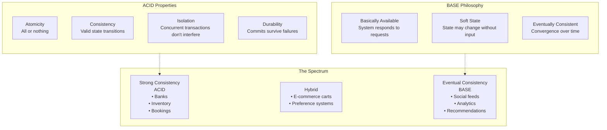

import { Aside, Card, CardGrid, Tabs, TabItem, Steps, Code } from '@astrojs/starlight/components';

## 6.1 ACID Deep Dive

ACID properties define transaction guarantees in traditional databases:

### Atomicity

All operations in a transaction succeed together or fail together. There is no partial state.

```sql
-- Example: Bank transfer (atomic)
BEGIN TRANSACTION;
    UPDATE accounts SET balance = balance - 100 WHERE id = 'alice';
    UPDATE accounts SET balance = balance + 100 WHERE id = 'bob';
COMMIT;
-- Either both updates happen, or neither happens
```

**What happens on failure**:

```sql
BEGIN TRANSACTION;
    UPDATE accounts SET balance = balance - 100 WHERE id = 'alice';  -- Succeeds
    UPDATE accounts SET balance = balance + 100 WHERE id = 'bob';    -- Fails (constraint violation)
ROLLBACK;
-- Alice's balance is unchanged - the first update was rolled back
```

### Consistency

A transaction brings the database from one valid state to another valid state. All constraints, triggers, and rules are enforced.

```sql
-- Example: Consistency constraint
ALTER TABLE accounts ADD CONSTRAINT positive_balance CHECK (balance >= 0);

BEGIN TRANSACTION;
    UPDATE accounts SET balance = balance - 1000 WHERE id = 'alice';
    -- Alice only has $500
COMMIT;  -- FAILS - violates positive_balance constraint
-- Database remains in original consistent state
```

### Isolation

Concurrent transactions don't interfere with each other. Each transaction sees a consistent snapshot.

**Isolation levels** (from weakest to strongest):

| Level | Dirty Reads | Non-Repeatable Reads | Phantom Reads |
|-------|-------------|---------------------|---------------|
| Read Uncommitted | ✓ Possible | ✓ Possible | ✓ Possible |
| Read Committed | ✗ Prevented | ✓ Possible | ✓ Possible |
| Repeatable Read | ✗ Prevented | ✗ Prevented | ✓ Possible |
| Serializable | ✗ Prevented | ✗ Prevented | ✗ Prevented |

```sql
-- Example: Isolation issue (non-repeatable read)
-- Transaction A                    -- Transaction B
BEGIN;                              
SELECT balance FROM accounts        
WHERE id = 'alice';                 
-- Returns: 500                     
                                    BEGIN;
                                    UPDATE accounts SET balance = 400
                                    WHERE id = 'alice';
                                    COMMIT;

SELECT balance FROM accounts        
WHERE id = 'alice';                 
-- Returns: 400 (different!)        
-- This is a non-repeatable read    
COMMIT;                             
```

```sql
-- PostgreSQL: Setting isolation level
BEGIN TRANSACTION ISOLATION LEVEL SERIALIZABLE;
    -- All reads are repeatable
    -- No phantoms possible
    -- But: may fail with serialization error, must retry
COMMIT;
```

### Durability

Once a transaction commits, it survives crashes, power failures, etc. Data is persisted to non-volatile storage.

<Aside type="note" title="Implementation: Write-ahead logging (WAL)">
<Steps>

1. Write changes to WAL (on disk)

2. Acknowledge commit to client

3. Apply changes to data files (asynchronously)

</Steps>

If crash occurs after step 2, WAL allows recovery of committed transactions.
</Aside>

## 6.2 BASE Philosophy

BASE is an alternative philosophy for distributed systems prioritizing availability:

<CardGrid>
  <Card title="Basically Available" icon="rocket">
    System guarantees availability (per CAP)
  </Card>
  <Card title="Soft state" icon="clock">
    State may change over time, even without input (due to eventual consistency)
  </Card>
  <Card title="Eventually consistent" icon="approve-check">
    Given enough time without updates, all replicas converge to the same value
  </Card>
</CardGrid>



### BASE in Practice

```python
# Example: Eventually consistent shopping cart (Cassandra/DynamoDB style)

class EventuallyConsistentCart:
    """
    Cart that prioritizes availability over consistency.
    Uses last-write-wins with vector clocks for conflict resolution.
    """
    
    def add_item(self, user_id, item_id, quantity):
        # Write to local node immediately
        # Replication happens asynchronously
        cart_item = {
            'user_id': user_id,
            'item_id': item_id,
            'quantity': quantity,
            'timestamp': time.time(),
            'node_id': self.local_node_id
        }
        
        # Local write - returns immediately
        self.local_store.write(cart_item)
        
        # Async replication - doesn't block
        self.replication_queue.enqueue(cart_item)
        
        return {'status': 'accepted'}  # Not 'confirmed'!
    
    def get_cart(self, user_id):
        # Read from local node - may be stale
        items = self.local_store.read(user_id)
        
        # Optionally: read-repair from other nodes
        if self.should_read_repair():
            self.trigger_background_repair(user_id)
        
        return items
    
    def resolve_conflicts(self, conflicting_items):
        """
        When replicas have different values, resolve using:
        1. Last-write-wins (by timestamp)
        2. Or merge (add quantities together)
        """
        # Last-write-wins
        return max(conflicting_items, key=lambda x: x['timestamp'])
        
        # Alternative: Merge strategy (CRDT-style)
        # return {'quantity': sum(i['quantity'] for i in conflicting_items)}
```

## 6.3 When ACID is Non-Negotiable

Some domains cannot tolerate inconsistency:

### Financial Transactions

```sql
-- Bank transfer: ACID required
BEGIN TRANSACTION ISOLATION LEVEL SERIALIZABLE;
    -- Check sufficient funds
    SELECT balance INTO @alice_balance FROM accounts WHERE id = 'alice' FOR UPDATE;
    
    IF @alice_balance < 100 THEN
        ROLLBACK;
        SIGNAL SQLSTATE '45000' SET MESSAGE_TEXT = 'Insufficient funds';
    END IF;
    
    -- Perform transfer atomically
    UPDATE accounts SET balance = balance - 100 WHERE id = 'alice';
    UPDATE accounts SET balance = balance + 100 WHERE id = 'bob';
    
    -- Record transaction for audit
    INSERT INTO transactions (from_account, to_account, amount, timestamp)
    VALUES ('alice', 'bob', 100, NOW());
COMMIT;
```

<Aside type="danger" title="Why ACID">
If Alice has $100 and tries two $100 transfers simultaneously, without ACID one might succeed while the other sees stale balance. Result: Alice transferred $200 with only $100.
</Aside>

### Inventory Systems (With High Cost of Overselling)

```python
# Atomic inventory reservation
def reserve_inventory(product_id: str, quantity: int) -> bool:
    with database.transaction(isolation='SERIALIZABLE'):
        current = db.query(
            "SELECT available_qty FROM inventory WHERE product_id = %s FOR UPDATE",
            [product_id]
        ).fetchone()
        
        if current.available_qty < quantity:
            raise InsufficientInventoryError()
        
        db.execute(
            "UPDATE inventory SET available_qty = available_qty - %s WHERE product_id = %s",
            [quantity, product_id]
        )
        
        db.execute(
            "INSERT INTO reservations (product_id, quantity, expires_at) VALUES (%s, %s, %s)",
            [product_id, quantity, datetime.now() + timedelta(minutes=15)]
        )
        
        return True
```

### Booking Systems (Seats, Appointments, Reservations)

<Aside type="caution">
Double-booking a flight seat, hotel room, or doctor's appointment is unacceptable. ACID ensures only one booking succeeds.
</Aside>

## 6.4 When BASE Enables Scale

Some domains benefit from relaxed consistency:

### Social Media Feeds

```python
# Eventually consistent feed (acceptable)
class SocialFeed:
    """
    When Alice posts, her followers don't need to see it instantly.
    Eventual consistency allows massive scale.
    """
    
    def post(self, user_id, content):
        # Write to user's timeline immediately
        self.user_timeline.append(user_id, content)
        
        # Fan out to followers asynchronously
        for follower_id in self.get_followers(user_id):
            # This might take seconds or minutes
            self.follower_timeline_queue.enqueue({
                'follower_id': follower_id,
                'content': content
            })
        
        return {'status': 'posted'}
    
    def get_feed(self, user_id):
        # Return whatever is in local timeline
        # Might be missing recent posts from people user follows
        return self.follower_timeline.read(user_id)
```

<Aside type="tip" title="Why BASE is Acceptable">
If a user sees a friend's post 30 seconds later, no business value is lost. But if the system is unavailable, user engagement drops.
</Aside>

### Activity Logs and Analytics

```python
# Eventually consistent event logging
class AnalyticsLogger:
    """
    Missing a few pageview events doesn't materially impact analytics.
    Prioritize availability and throughput.
    """
    
    def log_event(self, event):
        # Fire and forget - don't wait for confirmation
        try:
            self.kafka_producer.send(
                'events',
                value=event,
                # Don't wait for broker acknowledgment
            )
        except Exception as e:
            # Log locally, don't fail the user request
            self.local_buffer.append(event)
            self.metrics.increment('analytics.events.buffered')
        
        # Never block or fail the main user request
        return True
```

### Recommendation Systems

```python
# Eventually consistent recommendations
class RecommendationEngine:
    """
    Recommendations based on slightly stale data are still valuable.
    Fresh data isn't worth the latency cost.
    """
    
    def get_recommendations(self, user_id):
        # Read from cache (may be hours old)
        cached = self.cache.get(f'recs:{user_id}')
        if cached:
            return cached
        
        # Compute from eventually consistent feature store
        features = self.feature_store.get(user_id)  # Eventual consistency
        recommendations = self.model.predict(features)
        
        # Cache for future requests
        self.cache.set(f'recs:{user_id}', recommendations, ttl=3600)
        
        return recommendations
```

## 6.5 The Spectrum in Modern Systems

Modern distributed databases often offer tunable consistency, existing on a spectrum:

| System | Default Behavior | Tunable? | ACID Support |
|--------|------------------|----------|--------------|
| PostgreSQL | Strong ACID | Limited (sync/async replication) | Full |
| MySQL | Strong ACID | Limited | Full |
| MongoDB | Eventually consistent | Yes (write concern, read concern) | Multi-document ACID (4.0+) |
| Cassandra | Eventually consistent | Yes (consistency levels) | Lightweight transactions only |
| DynamoDB | Eventually consistent | Yes (strongly consistent reads) | Transactions (limited) |
| CockroachDB | Strong ACID | No (always serializable) | Full |
| Spanner | Strong ACID | No (always external consistency) | Full |
| TiDB | Strong ACID | Limited | Full |

### Tunable Consistency Example: MongoDB

<Tabs>
  <TabItem label="Eventually Consistent Write" icon="rocket">
    ```javascript
    // Fast write
    db.users.insertOne(
        { name: "Alice", email: "alice@example.com" },
        { writeConcern: { w: 1 } }  // Acknowledge after primary writes
    );
    ```
  </TabItem>
  <TabItem label="Strongly Consistent Write" icon="approve-check">
    ```javascript
    // Slower, safer write
    db.users.insertOne(
        { name: "Bob", email: "bob@example.com" },
        { writeConcern: { w: "majority", j: true } }  // Majority of replicas + journaled
    );
    ```
  </TabItem>
  <TabItem label="Eventually Consistent Read" icon="rocket">
    ```javascript
    // Fast read
    db.users.find({ email: "alice@example.com" })
        .readConcern("local");  // Read from local replica
    ```
  </TabItem>
  <TabItem label="Strongly Consistent Read" icon="approve-check">
    ```javascript
    // Slower read
    db.users.find({ email: "bob@example.com" })
        .readConcern("majority");  // Only return data acknowledged by majority
    ```
  </TabItem>
</Tabs>

## 6.6 Distributed ACID: NewSQL Databases

A new generation of databases provides ACID guarantees at scale:

<CardGrid>
  <Card title="Google Spanner" icon="star">
    - Globally distributed with strong consistency
    - Uses TrueTime (atomic clocks + GPS) for global ordering
    - External consistency: If transaction T1 commits before T2 starts, T1 is visible to T2 everywhere
  </Card>
  <Card title="CockroachDB" icon="rocket">
    - Open-source Spanner-inspired design
    - Serializable isolation by default
    - Automatic sharding and rebalancing
  </Card>
  <Card title="YugabyteDB" icon="seti:postgresql">
    - PostgreSQL-compatible wire protocol
    - Distributed ACID transactions
    - Tunable consistency for read-heavy workloads
  </Card>
</CardGrid>

```sql
-- CockroachDB: ACID transactions across distributed nodes
-- Works exactly like PostgreSQL

BEGIN;
    -- These rows might be on different nodes in different regions
    UPDATE accounts SET balance = balance - 100 WHERE id = 'alice';  -- Node in US-East
    UPDATE accounts SET balance = balance + 100 WHERE id = 'bob';    -- Node in EU-West
    
    -- CockroachDB ensures atomic commit across regions
COMMIT;
```

<Aside type="caution" title="Trade-off">
These systems have higher write latency than eventually consistent systems (cross-region coordination required), but provide strong guarantees.
</Aside>

### Key Takeaways

<CardGrid>
  <Card title="ACID vs BASE" icon="puzzle">
    ACID guarantees correctness; BASE enables availability and scale
  </Card>
  <Card title="Choose ACID For" icon="approve-check">
    Financial, inventory, and booking systems
  </Card>
  <Card title="Choose BASE For" icon="rocket">
    Social feeds, analytics, and recommendations
  </Card>
  <Card title="Tunable Consistency" icon="setting">
    Modern systems offer tunable consistency—choose per operation
  </Card>
  <Card title="NewSQL" icon="star">
    NewSQL databases provide distributed ACID when you need both scale and consistency
  </Card>
</CardGrid>

### Reflection Questions

<Steps>

1. In your current systems, which operations require ACID guarantees that aren't currently receiving them?

2. Which operations have stronger consistency than they need, potentially sacrificing performance?

3. How would you explain to a business stakeholder the trade-off between "always correct" and "always available"?

</Steps>
