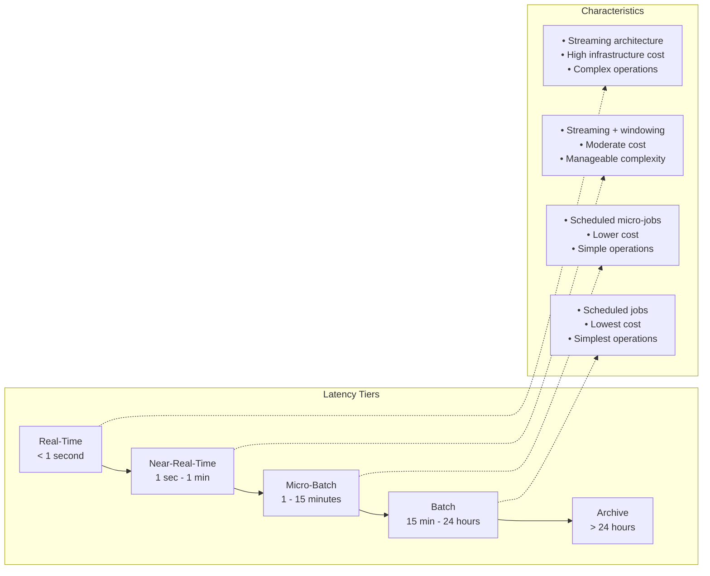
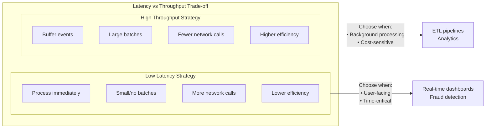
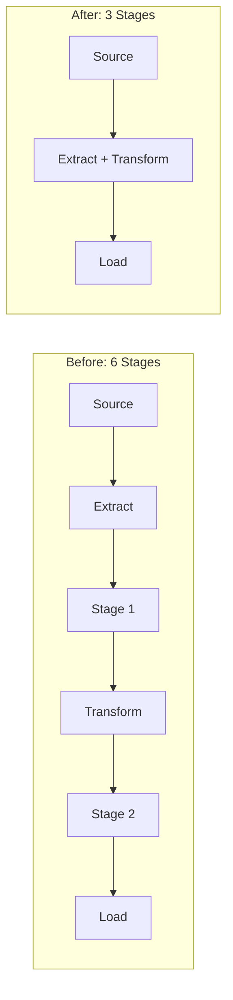

import { Aside, Card, CardGrid, Tabs, TabItem, Steps, Code } from '@astrojs/starlight/components';

## 7.1 Defining Latency Tiers

<Aside type="note">
Data latency isn't binary (real-time vs batch). It exists on a spectrum, and choosing the right tier is a critical architectural decision.
</Aside>



## 7.2 Matching Latency to Business Use Cases

| Latency Tier | Example Use Cases | Business Justification |
|--------------|-------------------|------------------------|
| **Real-Time (< 1 second)** | Fraud detection, trading, gaming leaderboards | Revenue loss or regulatory violation if delayed |
| **Near-Real-Time (1 sec - 1 min)** | Live dashboards, inventory updates, notifications | User experience or operational efficiency |
| **Micro-Batch (1 - 15 min)** | Operational alerts, pricing updates, session analytics | Business cycles operate at this frequency |
| **Batch (15 min - 24 hrs)** | Daily reports, ML training, historical analysis | Decisions made daily/weekly, not hourly |
| **Archive (> 24 hrs)** | Compliance, research, disaster recovery | Legal requirements, occasional access |

### The Latency Requirement Interview

Before choosing a tier, conduct this interview with stakeholders:

<Aside type="tip" title="Latency Requirements Discovery">

<Steps>

1. **What decision or action does this data support?**  
   [Understanding the downstream use case]

2. **What is the cost of this data arriving 1 hour late?**
   - Lost revenue: $________
   - Regulatory penalty: $________
   - Customer impact: ________
   - Operational inefficiency: ________

3. **What is the cost of this data arriving 1 day late?**  
   [Compare to hourly to understand the decay curve]

4. **How frequently do humans actually look at this data?**
   - Real-time (constantly monitored)
   - Hourly
   - Daily
   - Weekly
   - Ad-hoc

5. **Are there existing SLAs or contracts specifying latency?**  
   [External requirements override internal preferences]

6. **What is the budget for infrastructure to achieve lower latency?**  
   [Reality check on what's affordable]

</Steps>

</Aside>

## 7.3 The Cost Curve: Latency is Expensive

<Aside type="caution">
Lower latency costs exponentially more—in infrastructure, complexity, and operational burden.
</Aside>

```
                     │
 Infrastructure      │                                    ●
    Cost             │                               ●
                     │                          ●
                     │                     ●
                     │               ●
                     │         ●
                     │    ●
                     │●
                     └────────────────────────────────────────
                    Real-Time    NRT    Micro-Batch    Batch
                                 Latency Tier
```

**Real numbers** (approximate, highly variable):

| Latency Tier | Monthly Infrastructure Cost | Operational Complexity | On-Call Burden |
|--------------|----------------------------|----------------------|----------------|
| Batch (daily) | $1,000 - $5,000 | Low | Minimal |
| Micro-Batch (15min) | $3,000 - $15,000 | Low-Medium | Occasional |
| Near-Real-Time (1min) | $10,000 - $50,000 | Medium-High | Regular |
| Real-Time (< 1s) | $30,000 - $200,000+ | High | Significant |

### The Multipliers

<CardGrid>
  <Card title="Infrastructure" icon="rocket">
    Streaming infrastructure (Kafka, Flink) vs batch (Airflow, Spark)
  </Card>
  <Card title="Expertise" icon="star">
    Operational expertise (streaming specialists command premium)
  </Card>
  <Card title="Failure Modes" icon="error">
    Streaming failures are harder to diagnose and recover
  </Card>
  <Card title="Testing" icon="setting">
    Testing complexity (testing streaming is harder than testing batch)
  </Card>
</CardGrid>

## 7.4 Latency vs Throughput Trade-offs

<Aside type="tip">
You can optimize for latency OR throughput, not both simultaneously.
</Aside>

<Tabs>
  <TabItem label="Low Latency, Lower Throughput" icon="rocket">
    ```python
    # Process each event immediately
    async def process_event(event):
        # No batching - immediate processing
        result = await transform(event)
        await write_to_database(result)  # One write per event
        return result

    # Result: ~10ms latency, 100 events/second throughput
    ```
  </TabItem>
  <TabItem label="High Throughput, Higher Latency" icon="list-format">
    ```python
    # Batch events for efficient processing
    class BatchProcessor:
        def __init__(self, batch_size=1000, max_wait_seconds=5):
            self.buffer = []
            self.batch_size = batch_size
            self.max_wait = max_wait_seconds
            self.last_flush = time.time()
        
        async def add_event(self, event):
            self.buffer.append(event)
            
            if len(self.buffer) >= self.batch_size or \
               time.time() - self.last_flush > self.max_wait:
                await self.flush()
        
        async def flush(self):
            if not self.buffer:
                return
            
            # Batch transform and write
            results = await batch_transform(self.buffer)
            await batch_write_to_database(results)  # One write for many events
            
            self.buffer = []
            self.last_flush = time.time()

    # Result: ~5 second latency, 50,000 events/second throughput
    ```
  </TabItem>
</Tabs>

### The Trade-off in Practice



## 7.5 SLA Definition and Measurement

### Defining Meaningful SLAs

```yaml
# Example: Data Latency SLA Definition
data_pipeline_sla:
  name: "Order Events to Analytics"
  description: "Time from order placement to availability in analytics warehouse"
  
  measurement_points:
    start: "order.created event timestamp"
    end: "record available in analytics.orders table"
  
  targets:
    p50: 2 minutes   # 50% of events within 2 minutes
    p95: 5 minutes   # 95% of events within 5 minutes
    p99: 15 minutes  # 99% of events within 15 minutes
    max: 60 minutes  # No event should exceed 60 minutes
  
  exclusions:
    - "Planned maintenance windows"
    - "Force majeure events"
  
  measurement_frequency: "Continuous, reported hourly"
  
  breach_response:
    p95_breach: "Page on-call engineer"
    p99_breach: "Escalate to team lead"
    max_breach: "Incident declared, all hands"
```

### Percentile Latencies Explained

<Aside type="caution" title="Why Percentiles Matter More Than Averages">

```
Scenario: 1000 requests
- 990 requests complete in 50ms
- 10 requests complete in 5000ms

Average: (990 × 50 + 10 × 5000) / 1000 = 99.5ms
p50 (median): 50ms
p99: 5000ms

The average looks fine. But 1% of users wait 100x longer.
```

</Aside>

```python
# Calculating latency percentiles
import numpy as np

def calculate_latency_percentiles(latencies):
    """
    Calculate standard latency percentiles.
    
    Args:
        latencies: List of latency measurements in milliseconds
    
    Returns:
        Dictionary of percentile values
    """
    return {
        'p50': np.percentile(latencies, 50),
        'p75': np.percentile(latencies, 75),
        'p90': np.percentile(latencies, 90),
        'p95': np.percentile(latencies, 95),
        'p99': np.percentile(latencies, 99),
        'p999': np.percentile(latencies, 99.9),
        'max': np.max(latencies),
        'mean': np.mean(latencies)
    }

# Example usage
latencies = [50, 52, 48, 55, 51, 5000, 49, 53, 47, 54]  # One slow request
print(calculate_latency_percentiles(latencies))
# {'p50': 51.5, 'p95': 2527.5, 'p99': 4505.0, 'max': 5000, 'mean': 545.9}
```

### Measuring End-to-End Data Latency

```sql
-- Measure actual data latency in your warehouse
-- Compare event timestamp to ingestion timestamp

SELECT
    DATE_TRUNC('hour', event_timestamp) as hour,
    
    -- Percentiles of ingestion latency
    PERCENTILE_CONT(0.50) WITHIN GROUP (ORDER BY latency_seconds) as p50_latency,
    PERCENTILE_CONT(0.95) WITHIN GROUP (ORDER BY latency_seconds) as p95_latency,
    PERCENTILE_CONT(0.99) WITHIN GROUP (ORDER BY latency_seconds) as p99_latency,
    MAX(latency_seconds) as max_latency,
    
    -- Volume context
    COUNT(*) as event_count,
    
    -- SLA compliance
    SUM(CASE WHEN latency_seconds <= 300 THEN 1 ELSE 0 END)::float / COUNT(*) as sla_compliance_rate

FROM (
    SELECT 
        event_timestamp,
        ingested_at,
        EXTRACT(EPOCH FROM (ingested_at - event_timestamp)) as latency_seconds
    FROM analytics.events
    WHERE event_timestamp >= CURRENT_DATE - INTERVAL '7 days'
) latency_data
GROUP BY 1
ORDER BY 1 DESC;
```

```python
# Automated SLA monitoring
from dataclasses import dataclass
from typing import Optional
import datetime

@dataclass
class LatencySLA:
    name: str
    p50_target_seconds: float
    p95_target_seconds: float
    p99_target_seconds: float
    max_target_seconds: float

@dataclass
class SLAReport:
    sla: LatencySLA
    measurement_time: datetime.datetime
    p50_actual: float
    p95_actual: float
    p99_actual: float
    max_actual: float
    
    @property
    def is_p50_compliant(self) -> bool:
        return self.p50_actual <= self.sla.p50_target_seconds
    
    @property
    def is_p95_compliant(self) -> bool:
        return self.p95_actual <= self.sla.p95_target_seconds
    
    @property
    def is_p99_compliant(self) -> bool:
        return self.p99_actual <= self.sla.p99_target_seconds
    
    @property
    def is_fully_compliant(self) -> bool:
        return all([
            self.is_p50_compliant,
            self.is_p95_compliant,
            self.is_p99_compliant,
            self.max_actual <= self.sla.max_target_seconds
        ])
    
    def get_violations(self) -> list[str]:
        violations = []
        if not self.is_p50_compliant:
            violations.append(f"p50: {self.p50_actual:.1f}s > {self.sla.p50_target_seconds}s target")
        if not self.is_p95_compliant:
            violations.append(f"p95: {self.p95_actual:.1f}s > {self.sla.p95_target_seconds}s target")
        if not self.is_p99_compliant:
            violations.append(f"p99: {self.p99_actual:.1f}s > {self.sla.p99_target_seconds}s target")
        if self.max_actual > self.sla.max_target_seconds:
            violations.append(f"max: {self.max_actual:.1f}s > {self.sla.max_target_seconds}s target")
        return violations
```

## 7.6 Practical Techniques for Reducing Latency

### Technique 1: Reduce Processing Stages



<Aside type="note">
Every stage adds latency: serialization, network transfer, deserialization, scheduling overhead.
</Aside>

### Technique 2: Parallelize Where Possible

<Tabs>
  <TabItem label="Sequential (Slow)" icon="clock">
    ```python
    # Before: Sequential processing
    def process_partitions_sequential(partitions):
        results = []
        for partition in partitions:
            result = process_partition(partition)  # 10 seconds each
            results.append(result)
        return results  # 100 seconds for 10 partitions
    ```
  </TabItem>
  <TabItem label="Parallel (Fast)" icon="rocket">
    ```python
    # After: Parallel processing
    from concurrent.futures import ThreadPoolExecutor

    def process_partitions_parallel(partitions, max_workers=10):
        with ThreadPoolExecutor(max_workers=max_workers) as executor:
            results = list(executor.map(process_partition, partitions))
        return results  # ~10 seconds for 10 partitions (parallel)
    ```
  </TabItem>
</Tabs>

### Technique 3: Push Computation Closer to Data

<Tabs>
  <TabItem label="Move Data to Compute (Slow)" icon="download">
    ```python
    # Before: Move data to compute
    def aggregate_slow(source_table):
        # Pull all data to local machine
        df = spark.read.table(source_table)  # 1M rows, 5 minutes
        result = df.groupBy('category').agg(sum('amount'))
        return result
    ```
  </TabItem>
  <TabItem label="Push Computation to Data (Fast)" icon="rocket">
    ```python
    # After: Push computation to data
    def aggregate_fast(source_table):
        # Execute aggregation in the database
        return spark.sql(f"""
            SELECT category, SUM(amount) 
            FROM {source_table} 
            GROUP BY category
        """)  # Database does the work, returns small result
    ```
  </TabItem>
</Tabs>

### Technique 4: Use Incremental Processing

<Tabs>
  <TabItem label="Full Recompute (Slow)" icon="clock">
    ```python
    # Before: Full recompute every run
    def compute_daily_metrics_full():
        return spark.sql("""
            SELECT date, SUM(revenue) as total_revenue
            FROM orders
            WHERE date >= '2020-01-01'  -- Process ALL historical data
            GROUP BY date
        """)  # 30 minutes
    ```
  </TabItem>
  <TabItem label="Incremental Update (Fast)" icon="rocket">
    ```python
    # After: Incremental update
    def compute_daily_metrics_incremental(last_processed_date):
        # Only process new data
        new_data = spark.sql(f"""
            SELECT date, SUM(revenue) as total_revenue
            FROM orders
            WHERE date > '{last_processed_date}'
            GROUP BY date
        """)  # 30 seconds
        
        # Merge with existing results
        existing = spark.read.table('daily_metrics')
        return existing.union(new_data)
    ```
  </TabItem>
</Tabs>

### Technique 5: Optimize the Slowest Stage

```sql
-- Find the bottleneck: which stage takes longest?
SELECT
    stage_name,
    AVG(duration_seconds) as avg_duration,
    PERCENTILE_CONT(0.95) WITHIN GROUP (ORDER BY duration_seconds) as p95_duration,
    COUNT(*) as executions
FROM pipeline_stage_metrics
WHERE execution_date >= CURRENT_DATE - INTERVAL '7 days'
GROUP BY stage_name
ORDER BY avg_duration DESC;

-- Result might show:
-- stage_name          | avg_duration | p95_duration
-- join_customer_data  | 847          | 1203
-- aggregate_metrics   | 123          | 156
-- write_to_warehouse  | 45           | 67

-- Focus optimization on join_customer_data (the bottleneck)
```

<Aside type="tip">
Focus optimization on the bottleneck—faster non-bottleneck stages don't help.
</Aside>

### Key Takeaways

<CardGrid>
  <Card title="Latency Spectrum" icon="list-format">
    Latency exists on a spectrum; choose the tier that matches business value
  </Card>
  <Card title="Cost Curve" icon="warning">
    Lower latency costs exponentially more in infrastructure and complexity
  </Card>
  <Card title="Percentiles Matter" icon="magnifier">
    Measure latency with percentiles (p50, p95, p99), not averages
  </Card>
  <Card title="Define SLAs" icon="document">
    Define SLAs explicitly with clear measurement points and targets
  </Card>
  <Card title="Optimize Bottlenecks" icon="rocket">
    Optimize the bottleneck—faster non-bottleneck stages don't help
  </Card>
</CardGrid>

### Reflection Questions

<Steps>

1. What is the actual latency of your most critical data pipeline today? When was it last measured?

2. If you had to cut your data platform cost by 40% tomorrow, which latency requirements would you relax?

3. What would break if your real-time pipeline became a 15-minute batch job?

</Steps>
