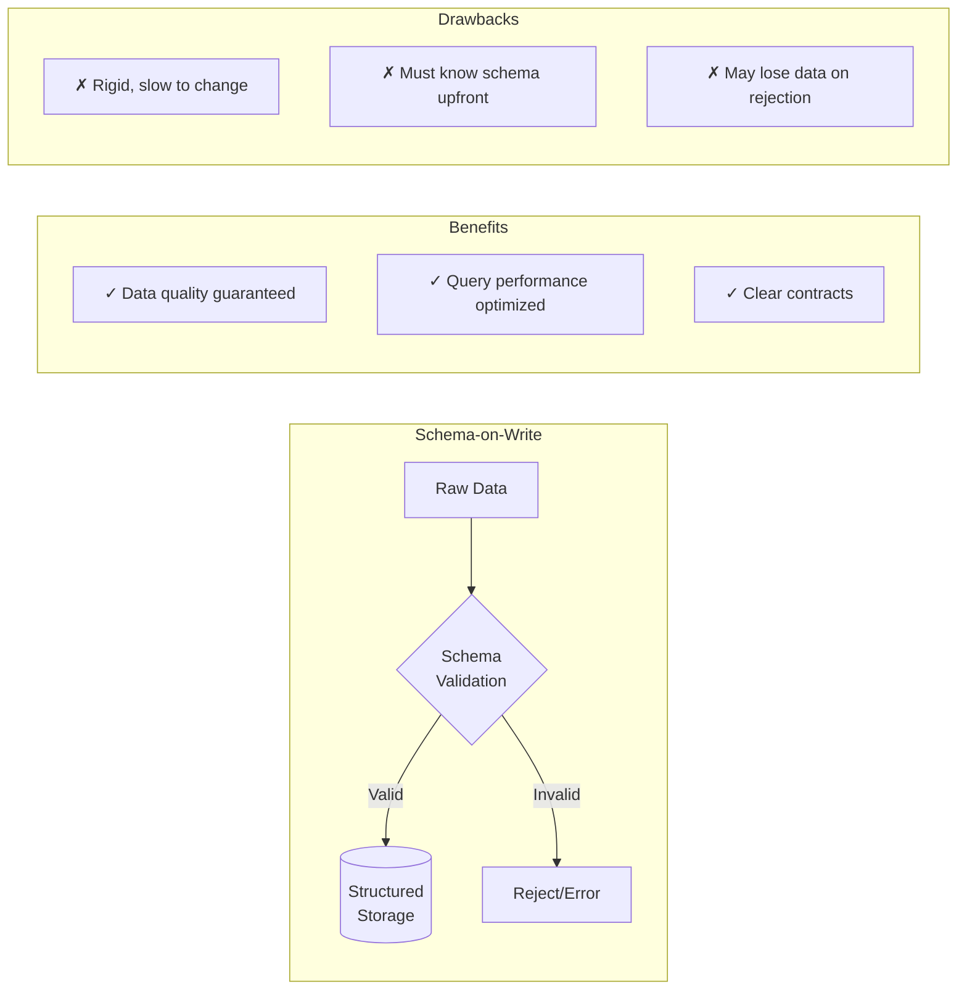
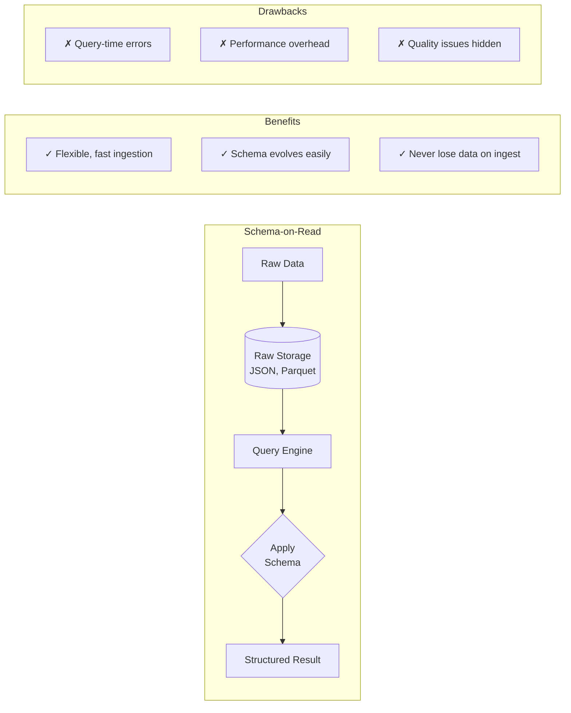
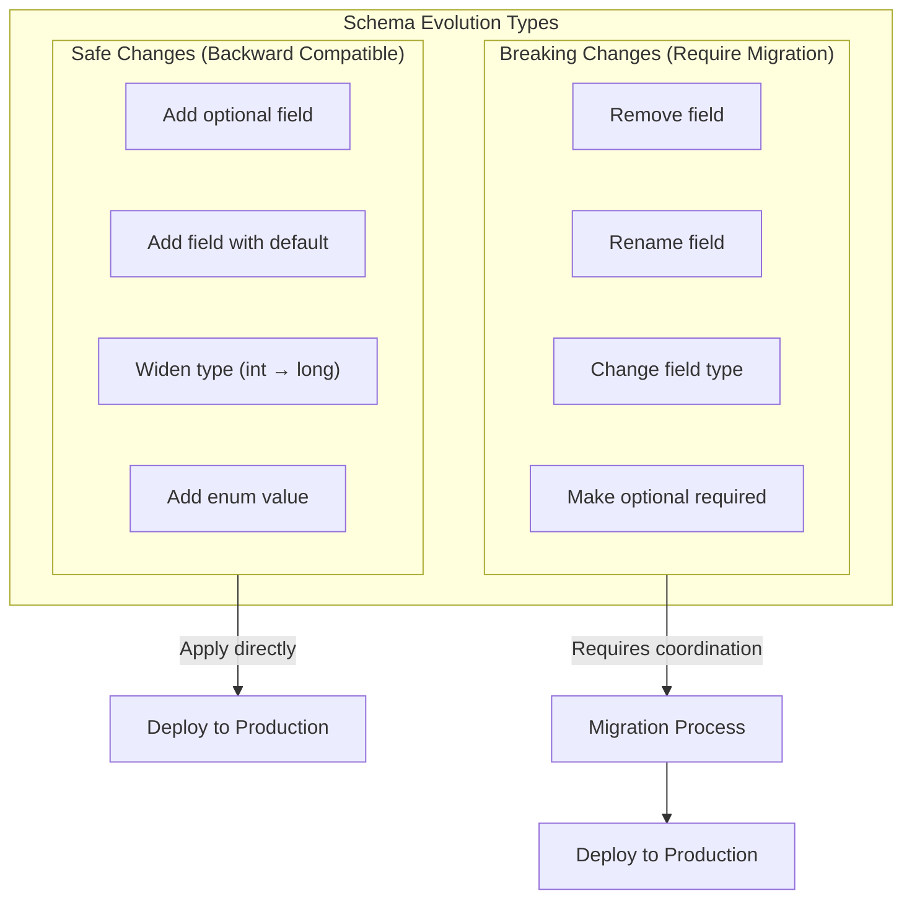
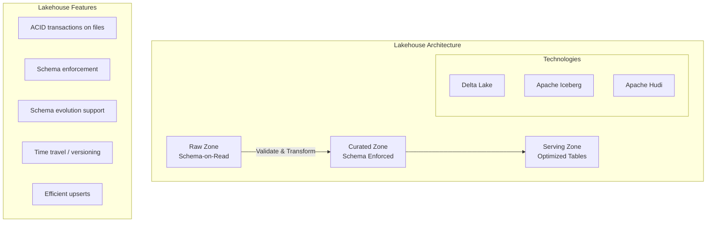

import { Aside, Card, CardGrid, Tabs, TabItem, Steps, Code } from '@astrojs/starlight/components';

## 8.1 Schema-on-Write: Enforced Structure

Schema-on-write means data must conform to a predefined structure at the moment it's written. If it doesn't conform, the write fails.



**Example: PostgreSQL Table**

```sql
-- Schema is defined upfront and enforced
CREATE TABLE orders (
    order_id UUID PRIMARY KEY,
    customer_id UUID NOT NULL REFERENCES customers(id),
    order_date TIMESTAMP NOT NULL,
    total_amount DECIMAL(10,2) NOT NULL CHECK (total_amount >= 0),
    status VARCHAR(20) NOT NULL CHECK (status IN ('pending', 'shipped', 'delivered', 'cancelled')),
    created_at TIMESTAMP DEFAULT CURRENT_TIMESTAMP
);

-- This insert works
INSERT INTO orders (order_id, customer_id, order_date, total_amount, status)
VALUES ('a1b2c3d4-...', 'x1y2z3-...', '2024-03-15', 99.99, 'pending');

-- This insert FAILS - schema enforced
INSERT INTO orders (order_id, customer_id, order_date, total_amount, status)
VALUES ('a1b2c3d4-...', 'x1y2z3-...', '2024-03-15', -50.00, 'unknown');
-- ERROR: new row violates check constraint "orders_total_amount_check"
-- ERROR: new row violates check constraint "orders_status_check"
```

## 8.2 Schema-on-Read: Deferred Structure

Schema-on-read means data is stored in its raw form. Structure is applied at query time.



**Example: Raw JSON in S3/Data Lake**

```python
# Store raw JSON - no schema enforcement
import json
import boto3

s3 = boto3.client('s3')

def store_event(event: dict):
    # Accept anything - no validation
    s3.put_object(
        Bucket='data-lake-raw',
        Key=f'events/{event.get("date", "unknown")}/{event.get("id", "unknown")}.json',
        Body=json.dumps(event)
    )

# These all succeed - no schema enforcement
store_event({"id": "123", "date": "2024-03-15", "amount": 99.99, "status": "pending"})
store_event({"id": "456", "date": "2024-03-15", "amount": "not_a_number", "status": 123})
store_event({"completely": "different", "structure": True})
```

```sql
-- Schema applied at query time
-- Works for conforming data, fails or returns NULL for non-conforming

SELECT 
    JSON_EXTRACT_SCALAR(raw_json, '$.id') as id,
    CAST(JSON_EXTRACT_SCALAR(raw_json, '$.amount') as DECIMAL) as amount,  -- May fail!
    JSON_EXTRACT_SCALAR(raw_json, '$.status') as status
FROM raw_events
WHERE date_partition = '2024-03-15';

-- For the malformed record, this might:
-- 1. Return NULL for amount (if CAST is lenient)
-- 2. Throw an error (if CAST is strict)
-- 3. Skip the row entirely (with TRY_CAST)
```

## 8.3 Advantages and Dangers

### Schema-on-Write

<Tabs>
  <TabItem label="Advantages" icon="approve-check">
    | Advantage | Explanation |
    |-----------|-------------|
    | **Data Quality** | Bad data can't enter the system |
    | **Query Performance** | Columnar storage, predicate pushdown, efficient encoding |
    | **Clear Contracts** | Producers and consumers agree on structure |
    | **Tooling Support** | IDEs, linters, type checkers work well |
  </TabItem>
  <TabItem label="Dangers" icon="warning">
    | Danger | Explanation |
    |--------|-------------|
    | **Data Loss** | Rejected records may be lost forever if not handled |
    | **Rigidity** | Schema changes require migrations, coordination |
    | **Upfront Design** | Must know structure before collecting data |
    | **Producer Burden** | Sources must transform data to fit schema |
  </TabItem>
</Tabs>

### Schema-on-Read

<Tabs>
  <TabItem label="Advantages" icon="approve-check">
    | Advantage | Explanation |
    |-----------|-------------|
    | **Agility** | Ingest first, figure out structure later |
    | **Exploration** | Useful for unknown or evolving data sources |
    | **No Data Loss** | Everything is stored, even if malformed |
    | **Producer Freedom** | Sources send what they have |
  </TabItem>
  <TabItem label="Dangers" icon="error">
    | Danger | Explanation | War Story |
    |--------|-------------|-----------|
    | **Hidden Quality Issues** | Problems discovered at query time, not ingest time | A data scientist spent 3 weeks on a model before realizing 30% of training data had NULL labels due to schema changes |
    | **Query Failures** | Malformed data breaks queries | Production dashboard failed every Monday because weekend events had different format |
    | **Performance** | Schema inference is expensive | A "simple" query took 45 minutes because it parsed 10TB of JSON |
    | **Technical Debt** | "We'll clean it up later" never happens | 4 years of raw JSON with 47 different implicit schemas, undocumented |
  </TabItem>
</Tabs>

## 8.4 Schema Evolution Strategies

Schemas change over time. How you handle changes determines system stability.



### Safe Changes: Add New Optional Fields

<Tabs>
  <TabItem label="PostgreSQL" icon="seti:postgresql">
    ```sql
    -- PostgreSQL: Safe schema evolution
    -- Adding a new column with default is safe

    ALTER TABLE orders ADD COLUMN shipping_method VARCHAR(50) DEFAULT 'standard';

    -- Existing queries continue to work
    -- New queries can use the new field
    -- Old data has the default value
    ```
  </TabItem>
  <TabItem label="Avro" icon="seti:json">
    ```python
    # Avro: Backward compatible schema evolution
    # Version 1
    schema_v1 = {
        "type": "record",
        "name": "Order",
        "fields": [
            {"name": "order_id", "type": "string"},
            {"name": "amount", "type": "double"}
        ]
    }

    # Version 2 - backward compatible (new optional field with default)
    schema_v2 = {
        "type": "record",
        "name": "Order",
        "fields": [
            {"name": "order_id", "type": "string"},
            {"name": "amount", "type": "double"},
            {"name": "currency", "type": "string", "default": "USD"}  # Safe!
        ]
    }

    # Readers with v2 schema can read v1 data (missing field gets default)
    ```
  </TabItem>
</Tabs>

### Breaking Changes: Require Migration

<Tabs>
  <TabItem label="Wrong Approach" icon="error">
    ```python
    # Breaking change: Renaming a field
    # WRONG: Just rename (breaks all consumers)
    schema_wrong = {
        "fields": [
            {"name": "order_total", "type": "double"}  # Was "amount" - BREAKS CONSUMERS
        ]
    }
    ```
  </TabItem>
  <TabItem label="Right Approach" icon="approve-check">
    ```python
    # RIGHT: Add new field, deprecate old, migrate
    schema_migration_step1 = {
        "fields": [
            {"name": "amount", "type": "double"},  # Keep old
            {"name": "order_total", "type": ["null", "double"], "default": None}  # Add new
        ]
    }

    # Producers start populating both fields
    # Consumers migrate to new field
    # After all consumers migrated, remove old field (step 2)
    ```
  </TabItem>
</Tabs>

### Field Deprecation Process

```python
from datetime import date
from typing import Optional

class SchemaField:
    """Track field lifecycle for safe evolution."""
    
    def __init__(
        self,
        name: str,
        introduced_date: date,
        deprecated_date: Optional[date] = None,
        removal_date: Optional[date] = None,
        replaced_by: Optional[str] = None
    ):
        self.name = name
        self.introduced_date = introduced_date
        self.deprecated_date = deprecated_date
        self.removal_date = removal_date
        self.replaced_by = replaced_by
    
    @property
    def is_deprecated(self) -> bool:
        return self.deprecated_date is not None and date.today() >= self.deprecated_date
    
    @property
    def is_safe_to_remove(self) -> bool:
        return self.removal_date is not None and date.today() >= self.removal_date

# Document field lifecycle
ORDER_SCHEMA_FIELDS = [
    SchemaField("amount", introduced_date=date(2020, 1, 1), 
                deprecated_date=date(2024, 1, 1),
                removal_date=date(2024, 7, 1),
                replaced_by="order_total"),
    SchemaField("order_total", introduced_date=date(2024, 1, 1)),
]
```

## 8.5 Schema Registries

Schema registries provide a centralized source of truth for data schemas, enabling:

<CardGrid>
  <Card title="Schema Versioning" icon="document">
    Schema versioning and history
  </Card>
  <Card title="Compatibility Checking" icon="approve-check">
    Compatibility checking (prevent breaking changes)
  </Card>
  <Card title="Schema Discovery" icon="magnifier">
    Schema discovery for consumers
  </Card>
  <Card title="Standardization" icon="setting">
    Serialization/deserialization standardization
  </Card>
</CardGrid>

### Confluent Schema Registry (Kafka Ecosystem)

```python
from confluent_kafka.schema_registry import SchemaRegistryClient
from confluent_kafka.schema_registry.avro import AvroSerializer, AvroDeserializer

# Connect to schema registry
schema_registry = SchemaRegistryClient({'url': 'http://schema-registry:8081'})

# Register a schema
schema_str = """
{
    "type": "record",
    "name": "Order",
    "namespace": "com.example",
    "fields": [
        {"name": "order_id", "type": "string"},
        {"name": "customer_id", "type": "string"},
        {"name": "amount", "type": "double"},
        {"name": "currency", "type": "string", "default": "USD"}
    ]
}
"""

# Schema ID is returned - used for serialization
schema_id = schema_registry.register_subject('orders-value', Schema(schema_str, 'AVRO'))
print(f"Registered schema with ID: {schema_id}")

# Set compatibility mode (prevents breaking changes)
schema_registry.set_compatibility('orders-value', 'BACKWARD')
# Options: BACKWARD, FORWARD, FULL, NONE
```

```bash
# Check schema compatibility before deploying
curl -X POST -H "Content-Type: application/vnd.schemaregistry.v1+json" \
    --data '{"schema": "{\"type\":\"record\",\"name\":\"Order\",\"fields\":[...]}"}' \
    http://schema-registry:8081/compatibility/subjects/orders-value/versions/latest

# Response: {"is_compatible": true} or {"is_compatible": false}
```

### AWS Glue Schema Registry

```python
import boto3

glue = boto3.client('glue')

# Create a registry
glue.create_registry(
    RegistryName='analytics-schemas',
    Description='Schemas for analytics data lake'
)

# Register a schema
response = glue.create_schema(
    RegistryId={'RegistryName': 'analytics-schemas'},
    SchemaName='orders',
    DataFormat='AVRO',
    Compatibility='BACKWARD',  # Enforce backward compatibility
    SchemaDefinition=schema_json_string
)

# Check compatibility before updating
compatibility_response = glue.check_schema_version_validity(
    DataFormat='AVRO',
    SchemaDefinition=new_schema_json_string
)

if compatibility_response['Valid']:
    glue.register_schema_version(
        SchemaId={'SchemaName': 'orders', 'RegistryName': 'analytics-schemas'},
        SchemaDefinition=new_schema_json_string
    )
```

## 8.6 Modern Middle Ground: Lakehouses

<Aside type="tip">
Lakehouse architectures combine the flexibility of data lakes with the structure of data warehouses.
</Aside>



### Delta Lake Example

```python
from delta import DeltaTable
from pyspark.sql import SparkSession

spark = SparkSession.builder \
    .config("spark.sql.extensions", "io.delta.sql.DeltaSparkSessionExtension") \
    .getOrCreate()

# Write with schema enforcement
df = spark.createDataFrame([
    {"order_id": "123", "amount": 99.99, "currency": "USD"},
    {"order_id": "456", "amount": 149.99, "currency": "EUR"}
])

# First write establishes schema
df.write.format("delta").mode("overwrite").save("/data/orders")

# Subsequent writes must match schema (or explicitly evolve it)
new_df = spark.createDataFrame([
    {"order_id": "789", "amount": "not_a_number", "currency": "GBP"}  # Wrong type!
])

# This FAILS - schema mismatch
new_df.write.format("delta").mode("append").save("/data/orders")
# AnalysisException: Failed to merge fields 'amount' and 'amount'. 
# Failed to merge incompatible data types double and string

# To add a new column, explicitly allow schema evolution
df_with_new_col = spark.createDataFrame([
    {"order_id": "789", "amount": 79.99, "currency": "GBP", "shipping_method": "express"}
])

df_with_new_col.write \
    .format("delta") \
    .mode("append") \
    .option("mergeSchema", "true") \  # Explicitly allow evolution
    .save("/data/orders")
```

### Apache Iceberg Example

```python
from pyspark.sql import SparkSession

spark = SparkSession.builder \
    .config("spark.sql.catalog.my_catalog", "org.apache.iceberg.spark.SparkCatalog") \
    .config("spark.sql.catalog.my_catalog.type", "hadoop") \
    .config("spark.sql.catalog.my_catalog.warehouse", "s3://my-bucket/iceberg") \
    .getOrCreate()

# Create table with explicit schema
spark.sql("""
    CREATE TABLE my_catalog.analytics.orders (
        order_id STRING,
        customer_id STRING,
        amount DOUBLE,
        order_date DATE
    )
    USING iceberg
    PARTITIONED BY (order_date)
""")

# Schema evolution - add column (safe)
spark.sql("""
    ALTER TABLE my_catalog.analytics.orders
    ADD COLUMN currency STRING DEFAULT 'USD'
""")

# Schema evolution - rename column (safe in Iceberg)
spark.sql("""
    ALTER TABLE my_catalog.analytics.orders
    RENAME COLUMN amount TO order_total
""")

# Time travel - query historical data
spark.sql("""
    SELECT * FROM my_catalog.analytics.orders
    VERSION AS OF 3  -- Query version 3 of the table
""")

# Or by timestamp
spark.sql("""
    SELECT * FROM my_catalog.analytics.orders
    TIMESTAMP AS OF '2024-03-01 00:00:00'
""")
```

### Key Takeaways

<CardGrid>
  <Card title="Quality vs Agility" icon="puzzle">
    Schema-on-write ensures quality but requires upfront design
  </Card>
  <Card title="Flexibility vs Safety" icon="warning">
    Schema-on-read enables agility but hides quality issues
  </Card>
  <Card title="Zone Strategy" icon="setting">
    Use schema-on-read for raw/landing zones, schema-on-write for curated/serving zones
  </Card>
  <Card title="Schema Registries" icon="approve-check">
    Schema registries prevent breaking changes in distributed systems
  </Card>
  <Card title="Lakehouse Benefits" icon="star">
    Lakehouse technologies combine file-based storage with warehouse-like schema enforcement
  </Card>
</CardGrid>

### Reflection Questions

<Steps>

1. Where in your current architecture do schema problems typically surface—at ingest or at query time?

2. How would you discover if an upstream source changed their schema yesterday?

3. What's the oldest undocumented schema in your data platform?

</Steps>
