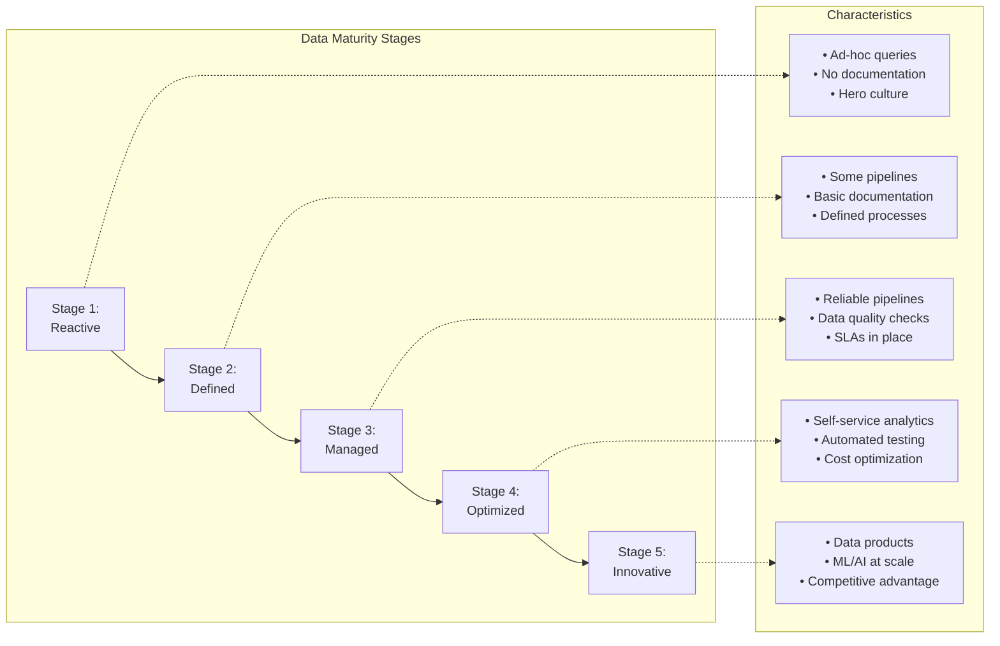
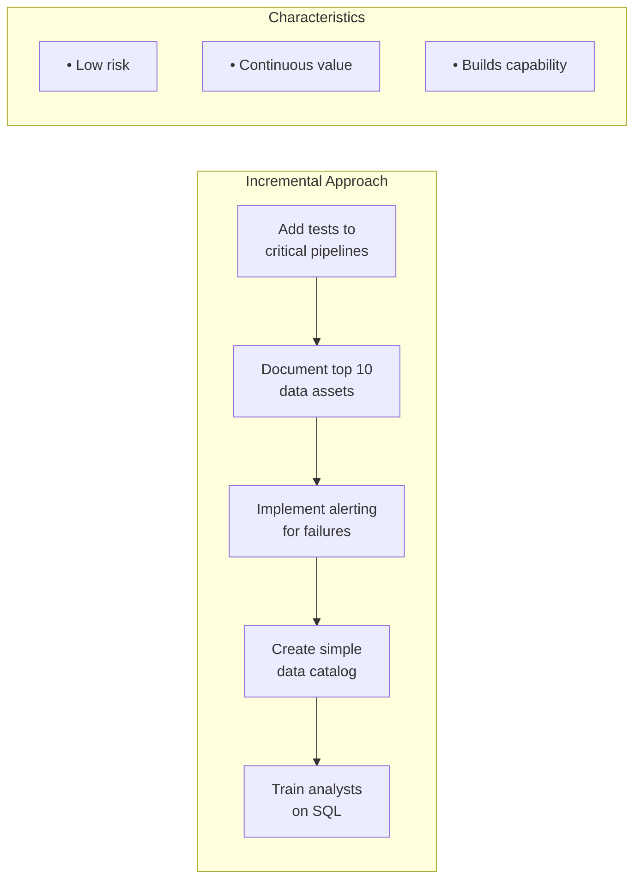
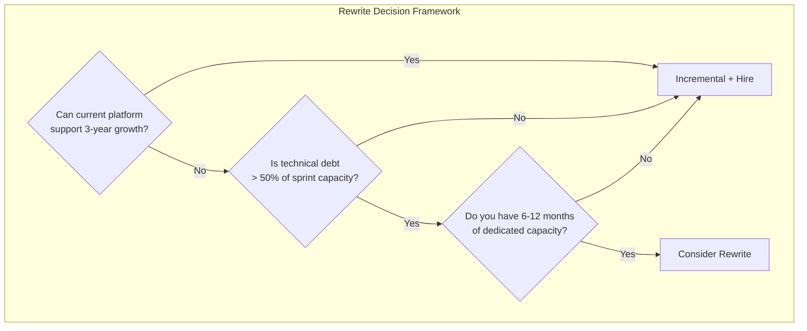

import { Aside, Card, CardGrid, Tabs, TabItem, Steps, Code } from '@astrojs/starlight/components';

## 9.1 Stages of Data Maturity

Organizations progress through predictable stages of data capability:



## 9.2 Detailed Stage Characteristics

### Stage 1: Reactive

<Tabs>
  <TabItem label="Symptoms" icon="warning">
    - Data lives in spreadsheets, emails, and individual databases
    - "The data person" (singular) knows where everything is
    - Queries are written ad-hoc, often from scratch
    - No version control for SQL or transformations
    - Reports are generated manually, often inconsistent
    - Data requests take days or weeks
  </TabItem>
  <TabItem label="Technical Indicators" icon="seti:sql">
    ```sql
    -- You might find queries like this in someone's desktop folder
    -- No comments, no version control, hardcoded values
    SELECT * FROM orders WHERE date > '2023-06-01' AND sales_rep = 'John';
    -- Run in production database directly
    ```
  </TabItem>
  <TabItem label="Organizational Indicators" icon="information">
    - No dedicated data team
    - Business users export to Excel for analysis
    - "Can you pull this data for me?" is a daily request
    - No idea how much data infrastructure costs
  </TabItem>
</Tabs>

### Stage 2: Defined

<Tabs>
  <TabItem label="Symptoms" icon="document">
    - First dedicated data engineer or analyst hired
    - Some pipelines exist (often fragile)
    - Basic documentation in wikis or READMEs
    - Defined (but not enforced) processes for data requests
    - Single data warehouse established
    - Still significant tribal knowledge
  </TabItem>
  <TabItem label="Technical Indicators" icon="seti:python">
    ```python
    # Airflow DAG exists, but limited error handling
    @dag(schedule='@daily', start_date=datetime(2024, 1, 1))
    def sales_pipeline():
        
        @task
        def extract():
            # Hardcoded credentials, no retry logic
            conn = psycopg2.connect("host=prod-db user=admin password=password123")
            return pd.read_sql("SELECT * FROM orders", conn)
        
        @task
        def load(df):
            # No schema validation, no data quality checks
            df.to_gbq('analytics.orders', if_exists='replace')
        
        load(extract())
    ```
  </TabItem>
  <TabItem label="Organizational Indicators" icon="information">
    - Data team of 1-3 people
    - Backlog of data requests exists
    - Some dashboards, but trust is mixed
    - "Can you check if this number is right?" is common
  </TabItem>
</Tabs>

### Stage 3: Managed

<Tabs>
  <TabItem label="Symptoms" icon="approve-check">
    - Reliable data pipelines with monitoring
    - Data quality checks implemented
    - SLAs defined and tracked
    - Documentation is current and discoverable
    - Self-service for simple queries
    - Clear ownership of data assets
  </TabItem>
  <TabItem label="Technical Indicators (dbt model)" icon="seti:sql">
    ```sql
    # models/marts/orders.sql
    """
    {{ config(
        materialized='incremental',
        unique_key='order_id',
        tags=['daily', 'finance']
    ) }}

    /*
        Orders fact table - source of truth for order metrics
        Owner: data-platform@company.com
        SLA: Updated by 6am UTC daily
    */

    WITH source AS (
        SELECT * FROM {{ ref('stg_orders') }}
        WHERE order_date > COALESCE(
            (SELECT MAX(order_date) FROM {{ this }}),
            '2020-01-01'
        )
    ),

    validated AS (
        SELECT *
        FROM source
        WHERE order_id IS NOT NULL
          AND total_amount >= 0
          AND customer_id IS NOT NULL
    )

    SELECT * FROM validated
    """
    ```
  </TabItem>
  <TabItem label="Technical Indicators (tests)" icon="setting">
    ```yaml
    # schema.yml - tests and documentation
    models:
      - name: orders
        description: "Cleaned and validated orders fact table"
        columns:
          - name: order_id
            description: "Unique order identifier"
            tests:
              - unique
              - not_null
          - name: total_amount
            tests:
              - not_null
              - dbt_utils.accepted_range:
                  min_value: 0
                  max_value: 1000000
    ```
  </TabItem>
  <TabItem label="Organizational Indicators" icon="information">
    - Data team of 5-15 people
    - Data catalog or documentation portal exists
    - Regular data quality reviews
    - Stakeholders trust "official" metrics
    - Incident response process for data issues
  </TabItem>
</Tabs>

### Stage 4: Optimized

<Tabs>
  <TabItem label="Symptoms" icon="star">
    - Self-service analytics for most use cases
    - Automated testing and deployment pipelines
    - Cost visibility and optimization practices
    - Data products with defined consumers
    - Advanced analytics and basic ML in production
    - Data governance program in place
  </TabItem>
  <TabItem label="Technical Indicators" icon="github">
    ```yaml
    # CI/CD pipeline for data assets
    # .github/workflows/data-ci.yml
    name: Data Pipeline CI

    on:
      pull_request:
        paths:
          - 'dbt/**'
          - 'airflow/**'

    jobs:
      test:
        runs-on: ubuntu-latest
        steps:
          - uses: actions/checkout@v3
          
          - name: Install dbt
            run: pip install dbt-snowflake
          
          - name: Run dbt compile
            run: dbt compile --target ci
          
          - name: Run dbt test
            run: dbt test --target ci --select state:modified+
          
          - name: Check SQL linting
            run: sqlfluff lint dbt/models/
          
          - name: Validate DAG structure
            run: python scripts/validate_dags.py
          
          - name: Cost impact analysis
            run: python scripts/estimate_query_cost.py --pr ${{ github.event.number }}

      deploy:
        needs: test
        if: github.ref == 'refs/heads/main'
        runs-on: ubuntu-latest
        steps:
          - name: Deploy to production
            run: dbt run --target prod --select state:modified+
    ```
  </TabItem>
  <TabItem label="Organizational Indicators" icon="information">
    - Dedicated data platform team
    - Business analysts can self-serve most queries
    - FinOps practices for data costs
    - Regular architecture reviews
    - ML models in production (beyond experimentation)
  </TabItem>
</Tabs>

### Stage 5: Innovative

<Tabs>
  <TabItem label="Symptoms" icon="rocket">
    - Data is a core business asset and competitive advantage
    - Data products generate revenue or significant efficiency
    - Real-time and streaming capabilities mature
    - Advanced ML/AI embedded in products
    - Data mesh or federated ownership models
    - Continuous experimentation culture
  </TabItem>
  <TabItem label="Technical Indicators" icon="seti:python">
    ```python
    # Feature store with real-time serving
    # Automated ML pipelines, A/B testing infrastructure

    from feast import FeatureStore

    store = FeatureStore(repo_path=".")

    # Real-time feature retrieval for ML serving
    features = store.get_online_features(
        features=[
            "user_features:lifetime_value",
            "user_features:purchase_frequency",
            "user_features:last_activity_days",
            "product_features:category_affinity_score"
        ],
        entity_rows=[{"user_id": "user_123", "product_id": "prod_456"}]
    ).to_dict()

    # Feed to real-time recommendation model
    recommendation = model.predict(features)
    ```
  </TabItem>
  <TabItem label="Organizational Indicators" icon="information">
    - Chief Data Officer or equivalent executive
    - Data team as a profit center, not cost center
    - Domain teams own their data products
    - Industry-recognized data capabilities
    - Data-driven decision making is cultural norm
  </TabItem>
</Tabs>

## 9.3 Common Stalls: Why Organizations Get Stuck

### Stuck at Stage 2 (Defined)

<Aside type="danger" title="Symptoms">
- "We have Airflow/dbt but things still break"
- Documentation exists but is outdated
- Data team is always firefighting
- Business still doesn't trust the data
</Aside>

<Tabs>
  <TabItem label="Root Causes" icon="error">
    <Steps>

    1. **Underinvestment in quality**: Pipelines built without testing or monitoring

    2. **Hero culture**: One person knows everything, no knowledge sharing

    3. **Technical debt accumulation**: "We'll fix it later" never happens

    4. **Lack of executive sponsorship**: Data seen as cost center

    </Steps>
  </TabItem>
  <TabItem label="Escape Path" icon="rocket">
    ## Stage 2 → Stage 3 Transition Checklist

    ### People
    - [ ] Hire or develop dedicated data quality focus
    - [ ] Implement on-call rotation (share the pain)
    - [ ] Document tribal knowledge before people leave

    ### Process
    - [ ] Define SLAs for critical pipelines
    - [ ] Implement incident review process
    - [ ] Create data request intake process with prioritization

    ### Technology
    - [ ] Add data quality testing to all pipelines
    - [ ] Implement alerting and monitoring
    - [ ] Create data catalog (even if simple)
    - [ ] Version control ALL SQL and transformations
  </TabItem>
</Tabs>

### Stuck at Stage 3 (Managed)

<Aside type="caution" title="Symptoms">
- Reliable pipelines but slow to change
- Self-service is "almost there" but never arrives
- Data team is bottleneck for new requests
- Advanced analytics/ML projects stall
</Aside>

<Tabs>
  <TabItem label="Root Causes" icon="warning">
    <Steps>

    1. **Centralized bottleneck**: All requests funnel through data team

    2. **Fear of change**: Working systems not refactored

    3. **Technical platform gaps**: Infrastructure doesn't support self-service

    4. **Skill gaps**: Team strong on engineering, weak on ML/advanced analytics

    </Steps>
  </TabItem>
  <TabItem label="Escape Path" icon="rocket">
    ## Stage 3 → Stage 4 Transition Checklist

    ### People
    - [ ] Embed data engineers in domain teams (or train domain analysts)
    - [ ] Hire or develop ML engineering capabilities
    - [ ] Create data champions in business units

    ### Process
    - [ ] Define data product ownership model
    - [ ] Implement self-service data request workflow
    - [ ] Create clear path for "promote to production" from ad-hoc analysis

    ### Technology
    - [ ] Deploy semantic layer or metrics store
    - [ ] Implement feature store for ML
    - [ ] Create sandbox environments for exploration
    - [ ] Automate pipeline deployment (CI/CD)
  </TabItem>
</Tabs>

## 9.4 Maturity Assessment Questionnaire

<Aside type="note">
Score each item: 0 (Not at all) to 4 (Fully implemented)
</Aside>

### Data Infrastructure (max 20 points)

- ___ Centralized data warehouse or lakehouse exists
- ___ Pipelines are version controlled
- ___ Automated testing for data pipelines
- ___ Monitoring and alerting in place
- ___ CI/CD for data assets

### Data Quality (max 20 points)

- ___ Data quality checks on critical pipelines
- ___ Schema validation at ingestion
- ___ Anomaly detection for key metrics
- ___ Data quality SLAs defined and tracked
- ___ Data quality issues are systematically addressed

### Documentation & Discovery (max 20 points)

- ___ Data catalog exists and is current
- ___ Business glossary defines key terms
- ___ Lineage tracking (where data comes from)
- ___ Documentation is discoverable (not hidden in wikis)
- ___ New team members can find data independently

### Self-Service & Access (max 20 points)

- ___ Business users can query data without data team
- ___ Semantic layer or governed metrics exist
- ___ Access controls are defined and enforced
- ___ Sandbox environments available for exploration
- ___ Training and support for self-service tools

### Advanced Capabilities (max 20 points)

- ___ ML models in production (not just experiments)
- ___ Real-time or streaming data available
- ___ Data products with defined consumers
- ___ A/B testing infrastructure exists
- ___ Data contributes directly to revenue/efficiency

### Scoring Guide

<CardGrid>
  <Card title="0-20 Points" icon="document">
    Stage 1 (Reactive)
  </Card>
  <Card title="21-40 Points" icon="pencil">
    Stage 2 (Defined)
  </Card>
  <Card title="41-60 Points" icon="approve-check">
    Stage 3 (Managed)
  </Card>
  <Card title="61-80 Points" icon="star">
    Stage 4 (Optimized)
  </Card>
  <Card title="81-100 Points" icon="rocket">
    Stage 5 (Innovative)
  </Card>
</CardGrid>

## 9.5 Building a Maturity Roadmap

### Incremental Improvements vs Platform Rewrites

<Aside type="tip" title="Default to Incremental Improvements">



</Aside>

**Platform rewrites only when**:

<Steps>

1. Current platform fundamentally cannot scale

2. Technical debt interest exceeds new development capacity

3. Business requirements are impossible on current stack

4. Team has capacity for 6-12 month investment

</Steps>



## 9.6 The People Dimension

### Skills Must Evolve with Maturity

| Stage | Key Skills Needed |
|-------|-------------------|
| 1 → 2 | SQL, basic Python, first orchestration tool |
| 2 → 3 | Testing practices, monitoring, documentation |
| 3 → 4 | CI/CD, infrastructure as code, ML basics, mentoring |
| 4 → 5 | Architecture, data mesh, advanced ML, leadership |

### Team Structure Evolution

<Tabs>
  <TabItem label="Stage 2: Centralized Generalists" icon="star">
    ```
    Stage 2: Centralized generalists
    ┌─────────────────────────────────┐
    │         Data Team               │
    │  ┌─────┐ ┌─────┐ ┌─────┐       │
    │  │ DE  │ │ DE  │ │ DA  │       │
    │  └─────┘ └─────┘ └─────┘       │
    └─────────────────────────────────┘
    ```
  </TabItem>
  <TabItem label="Stage 4: Platform + Embedded" icon="puzzle">
    ```
    Stage 4: Platform + Embedded specialists
    ┌───────────────────┐
    │   Data Platform   │ ← Shared infrastructure
    │  ┌─────┐ ┌─────┐  │
    │  │ PE  │ │ PE  │  │
    │  └─────┘ └─────┘  │
    └───────────────────┘
             │
        ┌────┴────┬─────────┐
        ▼         ▼         ▼
    ┌───────┐ ┌───────┐ ┌───────┐
    │Sales  │ │Product│ │Finance│ ← Domain teams with embedded data
    │Domain │ │Domain │ │Domain │
    │┌────┐ │ │┌────┐ │ │┌────┐ │
    ││ AE ││ ││ AE ││ ││ AE ││   (AE = Analytics Engineer)
    │└────┘ │ │└────┘ │ │└────┘ │
    └───────┘ └───────┘ └───────┘
    ```
  </TabItem>
</Tabs>

### Key Takeaways

<CardGrid>
  <Card title="Sequential Progress" icon="list-format">
    Maturity progression is sequential—you can't skip stages
  </Card>
  <Card title="Common Stall Point" icon="warning">
    Most organizations stall at Stage 2 due to underinvestment in quality
  </Card>
  <Card title="Incremental Wins" icon="approve-check">
    Incremental improvement beats platform rewrites in most cases
  </Card>
  <Card title="Skills Evolution" icon="star">
    Team skills must evolve alongside platform maturity
  </Card>
  <Card title="Prioritized Roadmap" icon="document">
    Assessment should drive prioritized roadmap, not boil-the-ocean initiatives
  </Card>
</CardGrid>

### Reflection Questions

<Steps>

1. What stage is your current organization at? What evidence supports your assessment?

2. What's the single biggest blocker preventing progression to the next stage?

3. If you could only improve three things in the next quarter, what would have the highest maturity impact?

</Steps>
