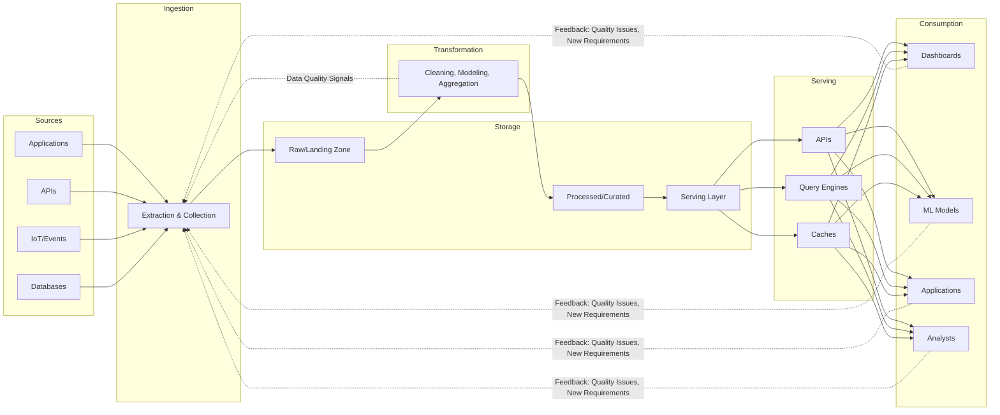

**What This Guide Covers**: A foundational curriculum spanning the critical concepts, patterns, failures, and decision frameworks that separate junior data engineers from architects who can design systems that scale.

**The Core Thesis**: Data engineering is not about tools—it's about making principled trade-offs under uncertainty. Every architectural decision involves sacrificing something: consistency for availability, latency for cost, flexibility for governance, simplicity for capability. Mastery comes from understanding *when* to make each trade-off, not from memorizing the "right" answer.

**Key Principles**:
1. **Failure is the teacher**: More wisdom lives in postmortems than in product documentation
2. **Context is everything**: Netflix's architecture is wrong for your startup; your startup's architecture is wrong for Netflix
3. **Simple systems fail less**: Complexity is a liability that must justify its cost
4. **Data quality compounds**: Garbage in, garbage forever—invest early in quality
5. **Observability is non-negotiable**: If you can't see it breaking, you can't fix it

**Decision Framework Summary**:
- **Batch vs Streaming**: Default to batch. Stream only when latency requirements *demand* it.
- **OLTP vs OLAP**: Use OLTP for transactions, OLAP for analysis. Never cross the streams.
- **ACID vs BASE**: Financial transactions get ACID. User activity feeds can be BASE.
- **Centralized vs Federated**: Start centralized. Federate when bottlenecks exceed coordination costs.

**The Hidden Cost Formula**:
```
True System Cost = Infrastructure + Operational Overhead + Cognitive Load + Technical Debt Interest + Opportunity Cost
```

Most teams optimize only the first term. Architects optimize all five.

---

# MODULE 1: What Data Engineering Actually Solves

## 1.1 The Core Mission

Data engineering exists because raw data is useless—and worse, it's dangerous. An unprocessed event stream, a corrupted JSON payload, a schema change that silently breaks downstream reports—these aren't edge cases. They're Tuesday.

The core mission is deceptively simple: **bridge the gap between raw data and reliable, actionable information**. This involves:

1. **Ingestion**: Getting data from where it's generated to where it can be processed
2. **Transformation**: Converting raw data into trustworthy, modeled information
3. **Storage**: Persisting data in formats optimized for its access patterns
4. **Serving**: Making data available with appropriate latency and access controls
5. **Consumption**: Enabling analysts, scientists, and applications to derive value

The challenge is that each of these steps can fail silently, at scale, in ways that propagate downstream for months before anyone notices.



## 1.2 Common Failure Modes

### Silent Data Corruption
The most dangerous failures are the ones nobody notices. A field changes from integer to string upstream. A timezone conversion introduces an off-by-one day error. A join condition silently produces duplicates. Reports continue to render. Dashboards stay green. Decisions get made on wrong data for weeks or months.

*War Story*: At a fintech company, a currency conversion rate was accidentally inverted for 73 days. Every transaction report showed inverted profits/losses. The issue was discovered only when Q3 numbers "didn't feel right" to the CFO. By then, investor communications had been sent with incorrect figures.

### Schema Drift
Upstream systems don't notify you when they change. That `user_id` field that was always an integer? Now it's sometimes a string UUID in the mobile app. Your pipeline continues running, casting to integer, and silently converting `"abc-123-def"` to `0`.

### Pipeline Debt
The "quick fix" pipeline that was supposed to be temporary—three years ago—is now load-bearing infrastructure. It has no tests, no documentation, and the engineer who wrote it left the company. It processes 40% of your critical business data.

### Lack of Observability
You can't find problems in systems you can't see. Most data pipelines have excellent observability for whether they *ran*, but none for whether they *ran correctly*. The pipeline succeeded. It processed 1.2 million rows. Is that right? Was it 1.4 million yesterday? Nobody knows.

## 1.3 The Iceberg of Data Engineering

What stakeholders see:
- Dashboards with charts
- SQL tables they can query
- APIs that return data

What they don't see:
- 47 orchestrated DAGs with 300+ dependencies
- Schema validation and enforcement logic
- Retry mechanisms and dead letter queues
- Monitoring alerts at 3 AM
- Data quality rules and anomaly detection
- Access control and PII handling
- Backup and recovery procedures
- Incident runbooks
- Cost optimization work

The visible 10% is where stakeholders measure value. The invisible 90% is where data engineering lives.

## 1.4 Why Most Data Pipelines Fail: Patterns from Postmortems

Analyzing hundreds of production incidents reveals consistent patterns:

| Failure Category | Frequency | Typical Cause | Prevention |
|-----------------|-----------|---------------|------------|
| Schema Evolution | 31% | Upstream changes without notification | Schema contracts, validation |
| Data Quality | 24% | Missing/malformed data passing through | Expectations, circuit breakers |
| Resource Exhaustion | 18% | Unbounded data, memory leaks | Backpressure, resource limits |
| Dependency Failures | 15% | Upstream system outages | Timeouts, fallbacks, idempotency |
| Configuration Errors | 12% | Wrong environments, bad credentials | IaC, deployment automation |

## 1.5 Role Distinctions

| Role | Primary Focus | Key Deliverables | Works With |
|------|---------------|------------------|------------|
| **Data Engineer** | Infrastructure, pipelines, reliability | Pipelines, data models, platform capabilities | Analytics Engineers, Platform teams |
| **Analytics Engineer** | Business logic, semantic modeling | dbt models, documentation, metrics definitions | Analysts, Data Engineers |
| **Data Analyst** | Insights, reporting, ad-hoc analysis | Dashboards, reports, analyses | Business stakeholders |
| **Data Scientist** | Statistical modeling, experimentation | Models, experiments, recommendations | ML Engineers, Product |
| **ML Engineer** | Model deployment, inference systems | Serving infrastructure, feature stores | Data Scientists, Platform teams |

The boundaries blur. In smaller organizations, one person wears many hats. In larger organizations, specialization increases. But the core distinction remains: **data engineers build infrastructure; analytics engineers define business logic; analysts extract insights; scientists build models; ML engineers deploy them.**

### Key Takeaways
- Data engineering's value is measured in reliability, not features
- Silent failures are more dangerous than loud ones
- Most pipeline failures stem from insufficient validation and observability
- The invisible infrastructure is where the real work happens

### Reflection Questions
1. If your data pipeline has been running successfully for six months, how confident are you that it's producing correct results right now?
2. What's the oldest "temporary" solution in your data infrastructure?
3. How long would it take to detect if a critical business metric was off by 15%?